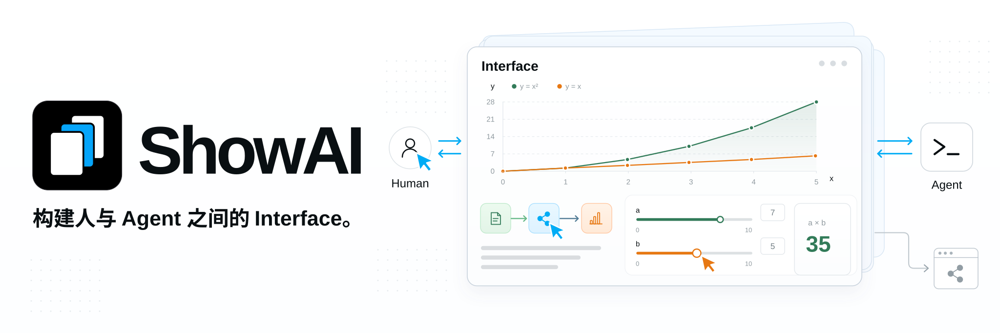

**Language:** English | [简体中文](docs/i18n/README.zh-CN.md) | [繁體中文](docs/i18n/README.zh-TW.md) | [日本語](docs/i18n/README.ja.md) | [한국어](docs/i18n/README.ko.md) | [Español](docs/i18n/README.es.md) | [Türkçe](docs/i18n/README.tr.md) | [Русский](docs/i18n/README.ru.md)

[Documentation](docs/README.md) · [Quick start](docs/quick-start.md) · [Use with Codex](docs/codex.md)

ShowAI helps humans and agents think together through content they can read, interact with, and edit. Agents organize information and analysis into pages, charts, and interactive models. Humans contribute through reading, exploration, edits, and feedback, building understanding, making decisions, and advancing their work in the same shared content.

This interface supports human–agent collaboration and co-creation. The resulting content can also become a shareable site that others can read, explore, and continue using.


### ✨ From understanding to co-creation

- **Give information the right form**: Combine text, images, tables, charts, flow diagrams, and interactive controls in one piece of content. Connect research findings to sources and data, explain complex relationships with diagrams, and explore parameter changes with interactive models.

  The component catalog provides descriptions, parameter schemas, and examples to help agents choose components for the task. When a new form of expression is needed, create a reusable component with React.

- **Let humans participate directly**: Read and use content within the agent's context, or edit and manage it in the ShowAI App as you would in a note-taking app. Agents can build on human edits. Both share page structure, component data, and version history to keep improving the same work.

  Pages support comparison, restoration, and structured merging. When concurrent changes conflict, the system preserves drafts and relevant versions for users to inspect and resolve.

- **Let the results travel**: Export finished content as standalone HTML, a fragment displayed in an agent conversation, or a static site with navigation.

  Standalone HTML includes the page, data, and components it uses. Readers can read and interact offline without installing ShowAI. Exported ShowAI HTML and JSON can be imported into the workbench for further editing.

## 🧩 Design


1. **Components: express information as needed.** Text, images, tables, charts, flow diagrams, and sliders provide different forms of expression and interaction. Agents can choose existing components or create and add new ones for a task, such as controls that let readers adjust parameters and inspect calculated results.

2. **Content and templates: organize content and reuse structure.** Components combine into content people can read and use. A [Page](docs/page-surface.md) arranges articles and reports in sequence; a Board uses spatial layout to organize relationships and proposals. Save common structures and component combinations as templates: fill an existing template with new material, or extract a template from finished content for future use. See [Components and templates](docs/catalog-lifecycle.md).

3. **Co-creation: participate in chat and the app.** In agent conversations that support page display, content appears directly in the chat. People can inspect charts and use controls, then ask the agent to continue analyzing and editing through follow-up messages.

   The ShowAI App provides a workbench similar to a note-taking app for managing projects and pages, editing content directly, and reusing components. Discussion can happen in the agent's context while content continues to be organized and refined in the app.

4. **Use and delivery: make content usable and shareable.** Standalone HTML preserves reading and interaction without requiring ShowAI. A static Site organizes multiple pages for sharing through a URL. Partial exports can share a component or region; source JSON supports importing and further editing so the results can keep being used.

## 💡 Use cases

- **Research and analysis**: Organize questions, sources, evidence, and comparisons to reach a judgment on one page.
- **Teaching and explanation**: Combine diagrams, collapsible content, and parameter experiments to support gradual understanding.
- **Data exploration**: Keep charts, raw data, and analysis together for inspection and verification.
- **Collaborative planning**: Refine proposals between humans and agents, record changes, and compare versions.
- **Knowledge sharing**: Turn shared work into pages or sites that others can read and explore.

## 🚀 Getting started

Running from source requires **Node.js 22.12+** and npm.

### Local browser workbench

```sh
git clone https://github.com/Renaissance-Mind/ShowAI.git
cd ShowAI
npm ci
npm run build:browser
npm run browser
```

The browser opens the local workbench after startup. Keep the terminal running while you use it; press `Ctrl+C` to stop the service.

### Desktop workbench

After installing dependencies in the repository directory, build and launch the Electron app:

```sh
npm run build
npm run desktop
```

### Create your first content

1. Create a project, then a Page or Board.
2. Type `/` to insert components, or choose an existing template.
3. Edit the content, or create it together with a connected agent.
4. Export HTML or a static site when finished.

The default content library is `~/.showai`; you can change it in settings. The desktop app, browser workbench, and CLI read and write the same projects when they point to the same library.

The local browser edition supports macOS, Linux, and Windows. It can also be packaged with a bundled Node runtime. See [Local browser edition](docs/local-browser.md) for the launcher and platform requirements.

## 🤖 Connect an agent

ShowAI provides plugins for Codex and Claude Code. After installing a plugin and connecting to the ShowAI runtime, you can ask for content directly:

> Create a model research report in the current project, with sources, a comparison table, and conclusions on the same page.

> Revise this explanation by adding an interactive model with adjustable parameters so readers can observe the effects of changes.

> Turn this page into a reusable template and create an example that uses it.

### Install a plugin

**Codex**: Run in the repository directory:

```sh
npm run plugin:install
```

**Claude Code**: Run in the repository directory:

```sh
claude plugin marketplace add ./
claude plugin install showai@renaissance-mind
```

The plugin includes four skills:

| Skill | Purpose |
| --- | --- |
| `use-showai` | Basic usage, runtime connection, finding and reading content, viewing history |
| `show-document` | Create, edit, display, and export pages; apply existing templates |
| `create-component` | Create or adapt reusable React components |
| `create-template` | Create and edit templates, or extract them from existing pages |

The plugin supplies authoring workflows and reference material. The ShowAI app or a standalone runtime package supplies the executable runtime. Desktop users can find startup configuration in Settings → Connect Agent (「设置 → 连接 Agent」). For a standalone runtime built from source, run:

```sh
npm run runtime:register
```

See [Plugin documentation](plugins/showai/README.md) for installation and connection steps.

### CLI and MCP

The CLI exits after each command and can be used while the workbench is closed. After building, run these commands in the repository directory:

```sh
# List existing projects
node dist-runtime/scripts/cli.mjs projects list --json

# Find available components
node dist-runtime/scripts/cli.mjs catalog list \
  --kind component --query 图表 --limit 5 --json

# Read the page authoring guide
node dist-runtime/scripts/cli.mjs guide authoring --json
```

Other agent clients can connect through the optional stdio MCP entry point. See [Agent guide](docs/agent-usage.md) for the complete commands, editing protocol, and configuration.

## 📦 Share pages and sites

| Export format | Use |
| --- | --- |
| **Standalone HTML** | Sharing, offline reading, and archiving |
| **inline fragment** | Display in agent conversations that support HTML |
| **Static site** | Multiple-page navigation and static hosting |

Standalone HTML supports offline interactions such as switching charts, collapsing content, and calculating local parameters. External source links require a network connection. Images must be embedded for offline exports.

Replace `PROJECT_ID` and `PAGE_ID` below with actual IDs to export a page:

```sh
node dist-runtime/scripts/cli.mjs export \
  --project PROJECT_ID \
  --page PAGE_ID \
  --format html \
  --out ./report.html \
  --json
```

Export the entire project as a static site:

```sh
node dist-runtime/scripts/cli.mjs export \
  --project PROJECT_ID \
  --format site \
  --out ./site \
  --json
```

Use `--blocks ID,ID` to export selected components or regions. HTML and inline exports also save a `.showai.json` source file for importing and further editing.

The static site directory can be deployed to your own server or a hosting service. See [Agent guide](docs/agent-usage.md) for export formats and options.

## 🔒 Content and history

Project content is stored locally and can be backed up or migrated. New empty libraries enable version history by default, recording content changes and available human or agent provenance.

The history interface supports comparing versions, inspecting changes, and restoring content. Restoration creates a new version. Components, templates, and page dependencies are also versioned so earlier content can be traced.

For collaboration across devices or with other people, connect to a self-hosted ShowAI Server to synchronize content and history by project. Administrator, editor, and viewer roles control access.

See [Content library and history](docs/versioned-library.md) and [Project server and synchronization](docs/project-sync.md).

## 📚 Documentation

| Document | Contents |
| --- | --- |
| [Page and Board](docs/page-surface.md) | Pages, boards, and interaction |
| [Agent guide](docs/agent-usage.md) | CLI, MCP, authoring, and export |
| [Plugin documentation](plugins/showai/README.md) | Skill responsibilities and installation |
| [Data charts](docs/g2-components.md) | Chart types, data interfaces, and settings |
| [Components and templates](docs/catalog-lifecycle.md) | Catalogs, versions, dependencies, and reuse |
| [Content library and history](docs/versioned-library.md) | Storage, comparison, merging, and restoration |
| [Project server and synchronization](docs/project-sync.md) | Server deployment, project permissions, and synchronization |
| [Page data format](docs/artifact-format.md) | Page structure and data conventions |

## 🛠️ Development and contributions

ShowAI uses React, TypeScript, Electron, and Vite. Rich text editing uses Tiptap, flow diagrams use React Flow, and data visualization uses G2.

Start the full desktop workbench with hot reload:

```sh
npm run dev:open
```

Check the current development service:

```sh
npm run dev:status
```

Use `npm run dev:browser` for browser development. The default development library is `.showai-dev/library`; startup arguments can select another directory.

Before submitting changes, run:

```sh
npx playwright install chromium
npm run check
npm test
npm run build
```

Install Chromium once for the browser-based tests. On Windows, directory-link tests use junctions; file-symlink tests report a skip when Developer Mode or symlink privileges are unavailable. Other path and integrity checks still run.

For desktop behavior, run `npm run test:desktop`. For Page and Board interactions, run `npm run test:containers` and `npm run test:containers:desktop`.

Use [Issues](https://github.com/Renaissance-Mind/ShowAI/issues) to report problems or suggest use cases, or contribute code, components, templates, and documentation through a pull request. Include your environment, reproduction steps, and expected and actual results when reporting a problem.

## License

ShowAI is licensed under the [MIT License](LICENSE).
