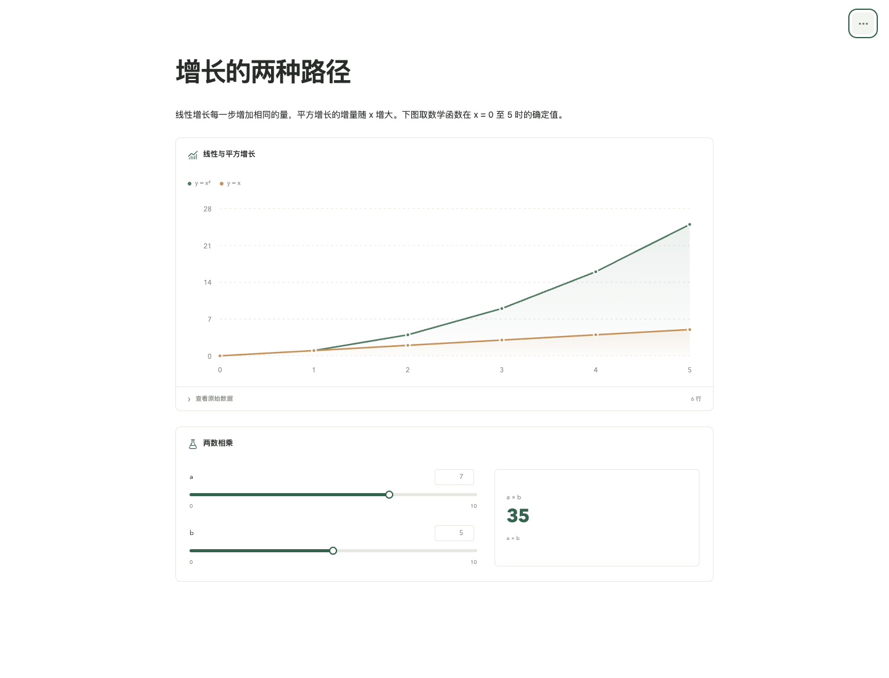

# ShowAI

给 Codex 的单页交互画布。

用 React 区块组织文字、图片、图表、表格和交互控件，生成一份独立 HTML 页面。编辑时直接操作内容，格式工具按需出现；交付时读者打开页面就能查看和探索结果。



## 启动

需要 Node.js 22.12+。

```bash
npm ci
npm run build
npm run dev
```

打开终端中的本地地址。画布默认空白，点击标题或正文即可编辑。输入 `/` 添加区块，选中文字设置格式，悬停在区块旁边可以移动、复制或删除。右上角可导出 HTML，其余文件操作收在菜单里。

## 单页交付

```bash
node scripts/render-artifact.mjs examples/welcome.showai.json artifacts/ShowAI.html
```

得到一个可直接打开的 HTML 文件，包含页面内容、React 渲染器和交互组件。图表切换、数据库筛选、折叠内容、参数计算在离线状态下仍可使用。源文件内嵌在页面中，可以从右上角菜单下载后继续编辑；编辑画布也支持直接打开导出的 HTML。

浏览器导出会内嵌图片，无法读取外链图片时会提示错误。命令行要求图片已转换为内嵌数据。外部来源链接仍指向原站点。

## Codex 插件

`npm run build` 会把阅读器、生成命令、格式说明和 skill 一起打包到 `plugins/showai`。仓库级插件目录配置在 `.agents/plugins/marketplace.json`，安装方式见[插件说明](plugins/showai/README.md)。

插件接受结构化的单页内容，生成 HTML 后直接返回该页面。JSON 源文件供后续修改使用，默认内嵌在 HTML 里。

## 区块扩展

内置文字与列表、表格、图片、提示和折叠内容，以及图表、数据库、指标、计算器、图片集和来源卡片。

```tsx
import { registerBlock } from "./src/components/blocks/registry";

registerBlock({
  kind: "my-block",
  title: "我的区块",
  description: "自定义交互内容",
  icon: "✦",
  defaultData: { message: "Hello" },
  renderer: ({ data }) => <div>{String(data.message)}</div>,
});
```

在编辑器和独立阅读器入口都加载注册代码，再重新构建，即可通过 `{ type: 'widget', attrs: { kind, data } }` 使用这个组件。数据格式见[页面格式](docs/artifact-format.md)。

## 本地保存

当前页面自动保存在浏览器中。打开另一个页面前会保留前一页的本地源数据；建议下载 JSON 或 HTML 作为文件备份。浏览器清理站点数据会移除这些副本。旧版工作区的数据保留在原有存储键中。

## 开发

```bash
npm run check
npm test
npm run build
npm run preview
```

`src/editor` 是区块编辑器，`src/components/blocks` 是交互区块，`src/portable` 是独立页面渲染器，`plugins/showai` 是 Codex 插件。发布许可证尚未指定。
