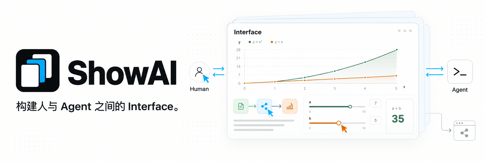

ShowAI 让人与 Agent 通过可阅读、可交互、可编辑的内容共同思考。Agent 将信息与分析组织成页面、图表和交互模型，人通过阅读、探索、修改和反馈参与其中，双方在同一份内容上持续形成理解、作出判断并推进创作。

这个 Interface 承载人机协作与共创，也让共同形成的内容成为可分享的 site，供更多人阅读、探索和继续使用。

**🤖 对 Agent：** 获得一个面向人的表达与协作界面，把信息和分析转化为人可以理解、操作与反馈的内容。

**🧑 对人：** 获得一个参与 AI 工作的认知界面，通过阅读、探索和修改，把自己的理解与判断带入共同创作。

### ✨ 从理解到共创

- **让信息有合适的表达**：把文字、图片、表格、图表、流程图和交互控件放在同一份内容中。研究发现可以对应到来源与数据，复杂关系可以展开为流程图，参数变化可以通过交互模型观察。

  组件库提供说明、参数结构和示例，帮助 Agent 根据表达需要选择组件。需要新的表达方式时，可以用 React 创建可复用组件。

- **让人直接参与内容**：人在 Agent 上下文中直接查看和使用内容，也可以在 ShowAI App 中像使用笔记软件一样编辑和管理内容。Agent 可以继续处理人的修改，双方共享页面结构、组件数据与版本历史，持续完善同一份成果。

  页面支持比较、恢复与结构化合并。并发修改发生冲突时，系统保留草稿和相关版本，供用户检查与处理。

- **让成果继续流动**：完成的内容可以导出为独立 HTML、Agent 对话中的展示片段，或带导航的静态网站。

  独立 HTML 包含页面、数据和所用组件，读者无需安装 ShowAI，也可以离线阅读与操作。导出的 ShowAI HTML 和 JSON 可以重新导入工作台，继续编辑。

## 🧩 设计逻辑


1. **组件：按需要表达信息。** 文本、图片、表格、图表、流程图和滑块提供不同的表达与交互方式。Agent 可以选择已有组件，也可以根据任务创建并加入新组件，例如让读者调整参数、观察计算结果的控件。

2. **内容（模板）：组织内容，复用结构。** 组件组合成可阅读、可操作的内容。[Page](docs/page-surface.md) 按顺序组织文章与报告，Board 用空间布局组织关系与方案；两者可以互相嵌套。常用的内容结构和组件组合可以保存为模板：应用模板填入新材料，或从完成的内容中提炼模板，供后续创作复用。详见[组件与模板说明](docs/catalog-lifecycle.md)。

3. **共同创作：在聊天与 App 中参与。** 在支持页面展示的 Agent 会话中，内容直接呈现在聊天里。人可以查看图表、操作控件，再通过后续对话让 Agent 继续分析和修改。

   ShowAI App 提供类似笔记软件的工作台，用于管理项目与页面、直接编辑内容和复用组件。讨论可以在 Agent 上下文中展开，内容也可以在 App 中持续整理和完善。

4. **使用与交付：让内容被使用和分享。** 独立 HTML 保留页面的阅读与交互，读者无需安装 ShowAI；静态 Site 组织多页内容，适合通过网址分享。局部导出可以只分享某个组件或区域，源 JSON 则用于导入并继续编辑，让成果能够持续使用。

## 💡 使用场景

- **调研与分析**：组织问题、来源、证据和比较结果，在同一页中形成判断。
- **教学与讲解**：结合流程图、折叠内容和参数实验，帮助读者逐步理解。
- **数据探索**：把图表、原始数据和分析文字放在一起，方便查看与核对。
- **方案共创**：在人与 Agent 之间持续修改方案，记录变化并比较版本。
- **知识分享**：将共同形成的内容整理为页面或 site，供他人阅读和探索。

## 🚀 开始使用

从源码运行需要 **Node.js 22.12+** 和 npm。

### 本地浏览器工作台

```sh
git clone https://github.com/Renaissance-Mind/ShowAI.git
cd ShowAI
npm ci
npm run build:browser
npm run browser
```

启动后，浏览器会打开本机工作台。使用期间保持终端运行，按 `Ctrl+C` 停止服务。

### 桌面工作台

在仓库目录中安装依赖后，构建并启动 Electron 应用：

```sh
npm run build
npm run desktop
```

### 创建第一份内容

1. 新建项目，再创建一个 Page 或 Board。
2. 输入 `/`，插入需要的组件；也可以选择已有模板。
3. 编辑内容，或让连接的 Agent 一起创作。
4. 完成后导出 HTML 或静态网站。

默认内容库为 `~/.showai`，可在设置中更改。桌面应用、浏览器工作台与 CLI 指向同一内容库时，共同读写其中的项目。

本地浏览器版支持 macOS、Linux 和 Windows，也可以打包为自带 Node 运行时的发行包。启动器与平台要求见[本地浏览器版说明](docs/local-browser.md)。

## 🤖 连接 Agent

ShowAI 提供 Codex 与 Claude Code 插件。安装插件并连接 ShowAI 运行时后，可以直接提出创作需求：

> 在当前项目中做一份模型调研报告，把来源、对比表和结论组织在同一页。

> 修改这份讲解，加入可以调整参数的交互模型，让读者观察参数变化的影响。

> 把这页整理成可复用模板，并生成一个应用示例。

### 安装插件

**Codex**：在仓库目录中执行：

```sh
npm run plugin:install
```

**Claude Code**：在仓库目录中执行：

```sh
claude plugin marketplace add ./
claude plugin install showai@renaissance-mind
```

插件包含四个 Skill：

| Skill | 用途 |
| --- | --- |
| `use-showai` | 基础用法、连接运行时、查找和阅读内容、查看历史 |
| `show-document` | 创建、修改、展示和导出页面，应用已有模板 |
| `create-component` | 创建或改造可复用的 React 组件 |
| `create-template` | 创建、修改模板，或从已有页面提炼模板 |

插件提供创作流程与参考说明，运行程序由 ShowAI 应用或独立运行包提供。桌面用户可在「设置 → 连接 Agent」中取得启动配置；从源码构建的独立运行包可执行：

```sh
npm run runtime:register
```

安装与接入步骤见[插件说明](plugins/showai/README.md)。

### CLI 与 MCP

CLI 每次执行一个命令后退出，可以在工作台关闭时使用。完成构建后，在仓库目录中执行：

```sh
# 查看已有项目
node dist-runtime/scripts/cli.mjs projects list --json

# 查询可用组件
node dist-runtime/scripts/cli.mjs catalog list \
  --kind component --query 图表 --limit 5 --json

# 查看页面创作指南
node dist-runtime/scripts/cli.mjs guide authoring --json
```

其他 Agent 客户端也可以通过可选的 stdio MCP 入口接入。完整命令、编辑协议与配置见 [Agent 使用说明](docs/agent-usage.md)。

## 📦 分享页面与 Site

| 导出格式 | 适用场景 |
| --- | --- |
| **独立 HTML** | 分享、离线阅读和归档 |
| **inline 片段** | 在支持 HTML 展示的 Agent 对话中呈现 |
| **静态网站** | 多页面导航与静态托管 |

独立 HTML 支持图表切换、折叠内容和本地参数计算等离线交互；外部来源链接需要联网。离线导出要求图片已内嵌。

将下方的 `PROJECT_ID` 和 `PAGE_ID` 替换为实际 ID，即可导出页面：

```sh
node dist-runtime/scripts/cli.mjs export \
  --project PROJECT_ID \
  --page PAGE_ID \
  --format html \
  --out ./report.html \
  --json
```

导出整个项目的静态网站：

```sh
node dist-runtime/scripts/cli.mjs export \
  --project PROJECT_ID \
  --format site \
  --out ./site \
  --json
```

使用 `--blocks ID,ID` 可以导出选定的组件或区域。HTML 与 inline 导出同时保存 `.showai.json` 源文件，便于重新导入和继续编辑。

静态网站目录可部署到自己的服务器或托管服务。导出格式与选项见 [Agent 使用说明](docs/agent-usage.md)。

## 🔒 内容与历史

项目内容保存在本机，支持备份与迁移。新建的空内容库默认启用版本历史，记录内容变化及可获得的人工或 Agent 来源信息。

历史界面支持比较版本、查看变更和恢复内容；恢复会生成新的版本。组件、模板与页面依赖也纳入版本管理，便于追溯过去的内容。

需要跨设备或与他人协作时，可以连接自部署的 ShowAI Server，按项目同步内容与历史，并通过管理员、编辑者和查看者角色管理访问权限。

详见[内容库与历史](docs/versioned-library.md)及[项目服务器与同步](docs/project-sync.md)。

## 📚 文档

| 文档 | 内容 |
| --- | --- |
| [Page 与 Board](docs/page-surface.md) | 页面、白板、嵌套与交互 |
| [Agent 使用说明](docs/agent-usage.md) | CLI、MCP、创作与导出 |
| [插件说明](plugins/showai/README.md) | Skill 分工与安装 |
| [数据图表](docs/g2-components.md) | 图表类型、数据接口与设置 |
| [组件与模板](docs/catalog-lifecycle.md) | 目录、版本、依赖与复用 |
| [内容库与历史](docs/versioned-library.md) | 存储、比较、合并与恢复 |
| [项目服务器与同步](docs/project-sync.md) | 服务部署、项目权限与同步 |
| [页面数据格式](docs/artifact-format.md) | 页面结构与数据约定 |

## 🛠️ 开发与贡献

ShowAI 使用 React、TypeScript、Electron 与 Vite。富文本编辑基于 Tiptap，流程图基于 React Flow，数据可视化使用 G2。

启动支持热更新的完整桌面工作台：

```sh
npm run dev:open
```

查看当前开发服务：

```sh
npm run dev:status
```

浏览器开发版使用 `npm run dev:browser`。默认开发内容库位于 `.showai-dev/library`，可以通过启动参数指定其他目录。

提交改动前执行：

```sh
npm run check
npm test
npm run build
```

涉及桌面行为时，可运行 `npm run test:desktop`；涉及 Page 与 Board 交互时，可运行 `npm run test:containers` 和 `npm run test:containers:desktop`。

欢迎通过 [Issues](https://github.com/Renaissance-Mind/ShowAI/issues) 反馈问题、提出使用场景，或通过 Pull Request 贡献代码、组件、模板与文档。问题反馈请附上运行环境、复现步骤，以及预期与实际结果。

## 许可证

ShowAI 使用 [MIT 许可证](LICENSE)。
