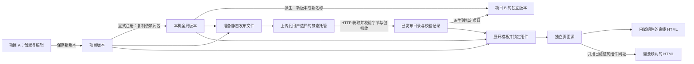
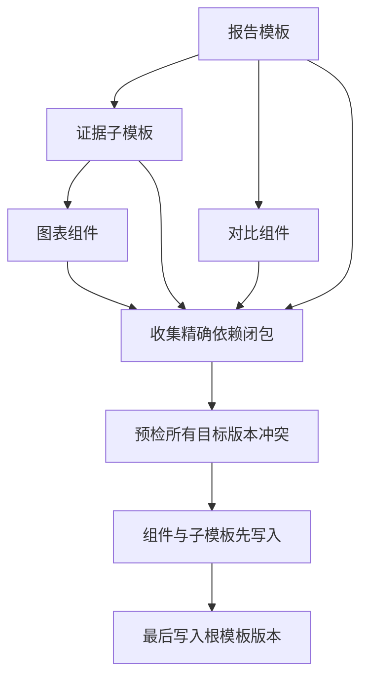

# 组件与模板的生命周期

ShowAI 将组件和模板保存为本地、可校验的版本。创作发生在项目中；明确注册到全局后，其他项目可以复用；通过实际网址校验的发布内容进入已发布目录。页面保存的是具体组件版本，模板在创建页面时展开。



## 作用域与解析

| 作用域      | 内容来源                       | 写入方式                                  |
| ----------- | ------------------------------ | ----------------------------------------- |
| `project`   | 当前项目创建、导入或派生的版本 | 指定真实、有效的 `projectId`，保存新版本  |
| `global`    | 用户明确注册到本机全局的版本   | `promotePackage`，目标必须明确为 `global` |
| `published` | 已导入的发布包                 | 发布校验流程调用 `importPublishedBundle`  |
| `builtin`   | 随应用提供的组件能力与模板     | 随应用发版；用户修改通过项目派生保存      |

项目写入必须带 `projectId`。缺少项目不会退回全局写入。当前项目的版本也不会自动出现在其他项目中。

普通查找按项目、全局、已发布的顺序进行；内置模板作为后备。读接口可以显式指定 `scope`。未指定版本时，查找在优先作用域中选择可用的新版本；持久化页面和依赖使用明确版本与指纹。

一个锁定引用的身份由四个字段组成：

```json
{
  "kind": "component",
  "id": "value-slider",
  "version": "1.1.0",
  "integrity": "sha256-<64位十六进制指纹>"
}
```

引用还可带 `scope` 和 `projectId` 作为查找提示。存储位置不属于上述身份。同一 `id`、同一 `version` 在不同作用域可以存在不同内容，因此仅比较名称和版本不足以确认对象。

带指纹查找时，如果优先作用域中的同名同版本指纹不符，会继续寻找匹配的版本；显式指定作用域则只在该作用域查找。页面保存前调用 `lockDocumentComponents`：它复制输入文档，校验组件参数，补齐 `version` 与 `integrity`，移除来源作用域提示，再返回可保存的文档。

## 不可变版本与派生

同一作用域中，每个组件或模板的 `id + version` 只对应一份内容。重复导入相同内容可以复用已有版本；改变内容需要新版本。修改项目中的派生版本不会更新全局或已发布版本。

`forkPackage` 将选定版本派生到指定项目，要求新版本号或新逻辑名称，并记录来源 `parents`。组件派生需要可读取的源码；仅含运行代码的便携组件会明确提示源码不可用。

为便携组件补回源码包时，会先重新编译并核对运行代码指纹。匹配的源码放进独立的指纹缓存，既有版本的 `compiled.json` 保持原样。源码缓存和原始源码包读取时也会检查来源摘要。

`parents`、`mergeBase` 用于溯源。运行依赖闭包按页面组件、组件源码依赖与子模板引用计算，历史父版本不会因此自动复制。历史版本缺失时，需要补回对应版本才能用于合并。

## 基础组件与代码嵌套

画布内容使用统一的组件目录。Markdown（`text`）统一承载标题、段落、列表、引用、代码块和分隔线，同一份内容可以混写这些语法。图像框与表格分别提供专门的编辑、布局和外观能力；折叠内容、交互组件和自定义组件保留专门的入口。Agent 通过目录查询、数据结构、示例和页面写入接口使用这些内容。已有提示框、代码块和分隔线数据仍可读取、渲染与导出。

内置组件提供可编辑的起始源码。用户可以从 `showai:components` 导入默认实现，在项目中保存自己的版本，修改参数、外观、语法处理与交互。该 SDK 导出 `Text`、`Image`、`Table`、`Callout`、`Toggle`、`Divider`、`Code` 和已有交互组件。

自定义组件通过 `manifest.dependencies` 声明子组件的完整版本与指纹，再在源码中从 `showai:component/<id>` 导入其 React 实现。编译器验证源码摘要，在每个包自身的边界内解析局部模块，并将所有子组件编译到同一运行代码中。子组件分别校验数据结构，编辑回调由父组件连接到自己的数据。嵌套最多 16 层、100 个包，依赖 ID 在单个父包内唯一。

父组件的离线运行代码包含子组件。注册到全局或准备发布时，依赖闭包同时保存每个固定版本与可用源码；后续项目可以继续派生组合组件。编译嵌套组件需要子组件的已验证源码。

组件与模板的概览采用同页说明和实时预览：宽窗口左右排列，窄窗口上下排列。组件切换示例时同时更新预览与示例数据，插入页面使用当前选中的示例。模板概览展示完整组合后的页面，其布局编辑沿用已有编辑入口。

## 三方合并

合并调用方明确提供 `base`、`ours`、`theirs` 三个锁定引用。Core 校验引用指纹和组件源码一致性，再产生预览：

1. 对 JSON 对象逐字段比较，合并双方互不冲突的修改。
2. 对源码和其他文本按行比较，合并不重叠的修改。
3. 同一字段的不同改动、修改与删除的冲突，以及重叠文本改动，返回明确的冲突位置和三边内容。

数组按整体字段处理。大文本超过比较规模限制时采用保守策略，可能需要人工处理更多冲突。预览在冲突位置保留 `ours` 作为可编辑草稿，同时返回 `conflicts`；预览不会写入目录。

保存合并结果需要传入完整的 `resolved` 内容，并选择新的版本身份（新版本号，或新逻辑名称）。保存时再次核实三个引用，创建项目版本，记录 `parents: [ours, theirs]` 和 `mergeBase: base`。组件源码会重新校验和编译，模板会重新锁定及验证依赖。

## 模板内容与组合

模板拥有 `version`、`integrity`、说明元数据和页面源。说明字段包括：

- `scenarios`：适用场景。
- `contentGuide`：各内容区域需要表达的信息。
- `related`：相关组件或模板及其用途。
- `examples`：具体需求，以及建议采用的组件、模板和顺序。

`related` 与示例步骤提供使用指导。实际运行依赖来自页面中的自定义组件引用，以及 `composition` 中的子模板引用。

没有 `composition` 时，模板直接使用 `document.content`。有 `composition` 时，以有序部分定义内容排列：

```json
[
  {
    "type": "content",
    "content": {
      "type": "paragraph",
      "content": [{ "type": "text", "text": "研究问题" }]
    }
  },
  {
    "type": "template",
    "ref": {
      "kind": "template",
      "id": "evidence-section",
      "version": "1.0.0",
      "integrity": "sha256-<64位十六进制指纹>"
    },
    "title": "证据"
  }
]
```

内容部分可以是一个区块或一个文档节点。子模板部分递归展开；可选 `title` 会在其前面插入二级标题。保存模板时，明确版本但尚未带指纹的输入引用会被解析并锁定；存储后的组合引用保留完整指纹。

`instantiateTemplateRecord` 验证循环、缺失依赖、递归深度和展开节点数，然后锁定组件引用，为新页面及区块分配新 ID。当前递归嵌套深度上限为 16，展开节点上限为 12,000。

展开后的页面可以独立编辑和导出。后续更新模板不会改变已有页面，阅读已生成页面也不需要再下载模板。

## 注册全局与依赖闭包

注册一个组合模板时，`resolvePackageBundle` 收集模板本身、全部子模板及使用到的自定义组件。组件可用的源码和本地资源也随包保存。



写入前会检查闭包中所有目标槽位：全局已有同名同版本且内容不同，整次操作会在写入前报冲突。组合引用和页面组件引用使用锁定身份，清除原项目的查找提示。因此，删除来源项目或者把全局目录复制到另一台设备后，完整注册的模板仍然可以展开。

每个新版本通过隐藏暂存目录和原子重命名发布。多个包之间没有跨文件系统事务或自动回滚；磁盘错误或进程中断可能留下已成功写入的依赖。根模板在依赖之后写入，重试时可以复用内容相同的版本。

## 发布与读取模式

发布准备生成 `manifest.json`、说明元数据，以及包含精确闭包的 `bundle.json`。文件路径包含传输内容的 SHA-256 摘要。准备阶段只创建本地文件；上传由用户选择的静态托管渠道完成。

发布校验会从实际网址获取清单和所有包，检查字节数、传输摘要、包指纹及依赖完整性。全部校验成功后，安装已发布版本并保存网址校验记录。每次验证有 64 MB 的传输上限，单个发布包上限为 32 MB。

内嵌模式将所需运行代码和资源放入 HTML，支持离线阅读。远程模式只接受具有有效本地校验记录的精确组件引用，阅读时按网址下载并校验相应包；此模式需要网络。

## 本地数据目录

默认目录为 `~/.showai`，可以通过 `SHOWAI_HOME` 指定其他根目录。

```text
~/.showai/
  projects/<projectId>/
    project.json
    pages/<pageId>.json
    packages/
      components/<id>/<version>/
        manifest.json
        props.schema.json
        <组件源码与资源>
        compiled.json
      components/<id>/.sources/<integrity>/
        <恢复的已校验源码>
        .source-integrity.json
      templates/<id>/<version>/template.json
  packages/
    components/<id>/<version>/...
    templates/<id>/<version>/template.json
    published/
      components/<id>/<version>/...
      templates/<id>/<version>/template.json
  publications/
    prepared/                         # 可选的发布输出位置
    verified/<receiptHash>.json       # 已验证网址、摘要和时间
  tmp/                               # 组件编译的暂存文件
```

恢复源码缓存由项目导入流程创建。发布准备也允许输出到指定项目的 `exports` 或其他安全的交付目录。

旧 `user` 作用域的目录继续从原来的 `packages` 路径读取，对外显示为 `global`。旧组件保留原指纹，不通过重新计算新内容来冒充原版本。旧扁平模板 `packages/templates/<id>.json` 作为只读 `0.0.0-legacy` 版本读取；派生后保存为新的项目版本。含未锁定自定义组件的旧模板需要先派生并锁定依赖，再进入闭包注册或发布流程。

## 实现入口

类型定义位于 [`types.ts`](../src/components/custom/types.ts)，页面组件引用定义位于 [`contract.ts`](../src/components/custom/contract.ts)。目录、版本、闭包和实例化在 [`catalog.ts`](../src/core/catalog.ts)；三方比较在 [`catalog-merge.ts`](../src/core/catalog-merge.ts)；发布准备、网址校验和校验记录在 [`publication.ts`](../src/core/publication.ts)。
