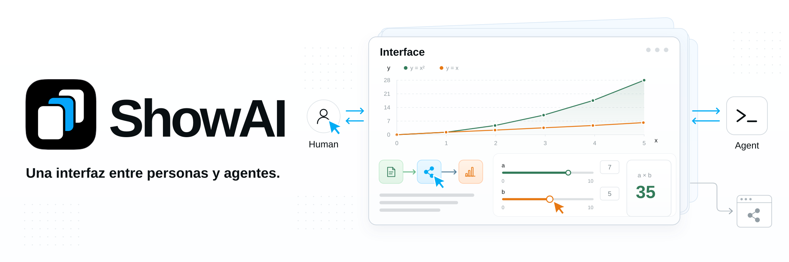

**Idioma:** [English](../../README.md) | [简体中文](README.zh-CN.md) | [繁體中文](README.zh-TW.md) | [日本語](README.ja.md) | [한국어](README.ko.md) | Español | [Türkçe](README.tr.md) | [Русский](README.ru.md)

ShowAI ayuda a las personas y a los agentes a pensar juntos mediante contenido que pueden leer, explorar y editar. Los agentes organizan la información y el análisis en páginas, gráficos y modelos interactivos. Las personas participan leyendo, explorando, modificando y aportando comentarios. Ambos desarrollan su comprensión, toman decisiones y avanzan en la creación sobre el mismo contenido.

Esta interfaz permite la colaboración y la creación conjunta entre personas y agentes. El contenido resultante también puede convertirse en un sitio compartible que otras personas puedan leer, explorar y seguir utilizando.

> [!NOTE]
> **🤖 Para los agentes:** Una interfaz para expresarse y colaborar con las personas, transformando información y análisis en contenido que puedan comprender, utilizar y comentar.

**🧑 Para las personas:** Una interfaz para participar en el trabajo de la IA y aportar su comprensión y criterio mediante la lectura, la exploración y la edición.

### ✨ De la comprensión a la creación conjunta

- **Dar a la información una forma adecuada**: Reúne texto, imágenes, tablas, gráficos, diagramas de flujo y controles interactivos en un mismo contenido. Vincula los resultados de investigación con sus fuentes y datos, explica relaciones complejas con diagramas y observa cambios de parámetros con modelos interactivos.

  El catálogo de componentes ofrece descripciones, estructuras de parámetros y ejemplos para que los agentes elijan los componentes adecuados. Cuando hace falta una nueva forma de expresión, se puede crear un componente reutilizable con React.

- **Permitir la participación directa de las personas**: Lee y utiliza el contenido dentro del contexto del agente, o edítalo y organízalo en ShowAI App como en una aplicación de notas. El agente puede continuar a partir de los cambios de una persona. Ambos comparten la estructura de la página, los datos de los componentes y el historial de versiones para mejorar el mismo trabajo.

  Las páginas admiten comparación, restauración y fusión estructurada. Cuando los cambios simultáneos entran en conflicto, el sistema conserva los borradores y las versiones pertinentes para que el usuario los revise y resuelva.

- **Compartir los resultados**: Exporta el contenido terminado como HTML independiente, un fragmento mostrado en una conversación con un agente o un sitio estático con navegación.

  El HTML independiente incluye la página, los datos y los componentes utilizados. Los lectores pueden leer e interactuar sin conexión y sin instalar ShowAI. El HTML y JSON exportados por ShowAI se pueden importar al espacio de trabajo para seguir editándolos.

## 🧩 Diseño


1. **Componentes: expresar la información según la necesidad.** Texto, imágenes, tablas, gráficos, diagramas de flujo y deslizadores ofrecen distintas formas de expresión e interacción. Los agentes pueden elegir componentes existentes o crear y añadir otros para una tarea, como controles que permitan ajustar parámetros y examinar los resultados del cálculo.

2. **Contenido y plantillas: organizar y reutilizar estructuras.** Los componentes se combinan para crear contenido que se puede leer y utilizar. Una [Page](../page-surface.md) organiza artículos e informes en secuencia; un Board utiliza una disposición espacial para organizar relaciones y propuestas. Pueden anidarse entre sí. Guarda estructuras y combinaciones habituales como plantillas: completa una plantilla con material nuevo o extráela de un contenido terminado para reutilizarla. Consulta [Componentes y plantillas](../catalog-lifecycle.md).

3. **Creación conjunta: participar en el chat y en la aplicación.** En las conversaciones con agentes que admiten la visualización de páginas, el contenido aparece directamente en el chat. Las personas pueden examinar gráficos y usar controles, y después pedir al agente que continúe analizando y editando mediante mensajes posteriores.

   ShowAI App ofrece un espacio de trabajo similar a una aplicación de notas para gestionar proyectos y páginas, editar contenido directamente y reutilizar componentes. La discusión puede desarrollarse en el contexto del agente mientras el contenido sigue organizándose y mejorándose en la aplicación.

4. **Uso y entrega: hacer que el contenido pueda utilizarse y compartirse.** El HTML independiente conserva la lectura y la interacción sin necesitar ShowAI. Un Site estático organiza varias páginas para compartirlas mediante una URL. Las exportaciones parciales permiten compartir un componente o una región; el JSON original permite importar y seguir editando el resultado.

## 💡 Casos de uso

- **Investigación y análisis**: Organiza preguntas, fuentes, pruebas y comparaciones para llegar a una conclusión en una sola página.
- **Enseñanza y explicación**: Combina diagramas, contenido desplegable y experimentos con parámetros para facilitar una comprensión progresiva.
- **Exploración de datos**: Reúne gráficos, datos originales y análisis para examinarlos y verificarlos.
- **Planificación colaborativa**: Revisa propuestas entre personas y agentes, registra cambios y compara versiones.
- **Compartir conocimiento**: Convierte el trabajo conjunto en páginas o sitios que otras personas puedan leer y explorar.

## 🚀 Primeros pasos

Para ejecutar desde el código fuente necesitas **Node.js 22.12+** y npm.

### Espacio de trabajo local en el navegador

```sh
git clone https://github.com/Renaissance-Mind/ShowAI.git
cd ShowAI
npm ci
npm run build:browser
npm run browser
```

Tras el inicio, el navegador abre el espacio de trabajo local. Mantén el terminal en ejecución mientras lo utilizas y pulsa `Ctrl+C` para detener el servicio.

### Espacio de trabajo de escritorio

Después de instalar las dependencias en el directorio del repositorio, compila e inicia la aplicación Electron:

```sh
npm run build
npm run desktop
```

### Crear tu primer contenido

1. Crea un proyecto y, después, una Page o un Board.
2. Escribe `/` para insertar componentes o elige una plantilla existente.
3. Edita el contenido o créalo junto con un agente conectado.
4. Al terminar, exporta HTML o un sitio estático.

La biblioteca de contenido predeterminada es `~/.showai` y se puede cambiar en la configuración. La aplicación de escritorio, el navegador y la CLI leen y escriben los mismos proyectos cuando apuntan a la misma biblioteca.

La edición local para navegador admite macOS, Linux y Windows. También se puede empaquetar con un entorno de ejecución Node incluido. Consulta [Edición local para navegador](../local-browser.md) para conocer el lanzador y los requisitos de plataforma.

## 🤖 Conectar un agente

ShowAI ofrece plugins para Codex y Claude Code. Después de instalar un plugin y conectarlo al entorno de ejecución de ShowAI, puedes solicitar la creación de contenido directamente:

> Crea un informe de investigación sobre modelos en el proyecto actual, con fuentes, una tabla comparativa y conclusiones en una misma página.

> Modifica esta explicación añadiendo un modelo interactivo con parámetros ajustables para que los lectores puedan observar el efecto de los cambios.

> Convierte esta página en una plantilla reutilizable y crea un ejemplo que la utilice.

### Instalar un plugin

**Codex**: Ejecuta en el directorio del repositorio:

```sh
npm run plugin:install
```

**Claude Code**: Ejecuta en el directorio del repositorio:

```sh
claude plugin marketplace add ./
claude plugin install showai@renaissance-mind
```

El plugin incluye cuatro Skills:

| Skill | Propósito |
| --- | --- |
| `use-showai` | Uso básico, conexión al entorno de ejecución, búsqueda y lectura de contenido, consulta del historial |
| `show-document` | Crear, editar, mostrar y exportar páginas; aplicar plantillas existentes |
| `create-component` | Crear o adaptar componentes React reutilizables |
| `create-template` | Crear y editar plantillas, o extraerlas de páginas existentes |

El plugin proporciona flujos de creación y material de referencia. La aplicación ShowAI o un paquete independiente proporciona el entorno de ejecución. Los usuarios de escritorio pueden obtener la configuración de inicio en Ajustes → Conectar Agent (「设置 → 连接 Agent」). Para un paquete independiente compilado desde el código fuente, ejecuta:

```sh
npm run runtime:register
```

Consulta la [Documentación del plugin](../../plugins/showai/README.md) para instalarlo y conectarlo.

### CLI y MCP

La CLI termina después de cada comando y se puede utilizar con el espacio de trabajo cerrado. Después de compilar, ejecuta estos comandos en el directorio del repositorio:

```sh
# Listar proyectos existentes
node dist-runtime/scripts/cli.mjs projects list --json

# Buscar componentes disponibles
node dist-runtime/scripts/cli.mjs catalog list \
  --kind component --query 图表 --limit 5 --json

# Consultar la guía de creación de páginas
node dist-runtime/scripts/cli.mjs guide authoring --json
```

Otros clientes de agentes pueden conectarse mediante la entrada stdio MCP opcional. Consulta la [Guía para agentes](../agent-usage.md) para los comandos completos, el protocolo de edición y la configuración.

## 📦 Compartir páginas y sitios

| Formato de exportación | Uso |
| --- | --- |
| **HTML independiente** | Compartir, leer sin conexión y archivar |
| **Fragmento inline** | Mostrar en conversaciones con agentes que admitan HTML |
| **Sitio estático** | Navegación entre varias páginas y alojamiento estático |

El HTML independiente permite interacciones sin conexión, como cambiar gráficos, plegar contenido y calcular parámetros locales. Los enlaces a fuentes externas necesitan conexión a la red. Para exportar sin conexión, las imágenes deben estar incrustadas.

Sustituye `PROJECT_ID` y `PAGE_ID` por los ID reales para exportar una página:

```sh
node dist-runtime/scripts/cli.mjs export \
  --project PROJECT_ID \
  --page PAGE_ID \
  --format html \
  --out ./report.html \
  --json
```

Exporta todo el proyecto como un sitio estático:

```sh
node dist-runtime/scripts/cli.mjs export \
  --project PROJECT_ID \
  --format site \
  --out ./site \
  --json
```

Utiliza `--blocks ID,ID` para exportar componentes o regiones seleccionados. Las exportaciones HTML e inline también guardan un archivo original `.showai.json` para importar y seguir editando.

El directorio del sitio estático se puede desplegar en tu propio servidor o en un servicio de alojamiento. Consulta la [Guía para agentes](../agent-usage.md) para formatos y opciones.

## 🔒 Contenido e historial

El contenido de los proyectos se almacena localmente y se puede respaldar o migrar. Las bibliotecas nuevas y vacías activan el historial de versiones de forma predeterminada, registrando cambios y la procedencia humana o de agentes que esté disponible.

La interfaz del historial permite comparar versiones, revisar cambios y restaurar contenido. Una restauración crea una versión nueva. Los componentes, las plantillas y las dependencias de las páginas también se versionan para poder rastrear contenido anterior.

Para colaborar entre dispositivos o con otras personas, conecta un ShowAI Server alojado por ti para sincronizar contenido e historial por proyecto. Los roles de administrador, editor y lector controlan el acceso.

Consulta [Biblioteca de contenido e historial](../versioned-library.md) y [Servidor de proyectos y sincronización](../project-sync.md).

## 📚 Documentación

| Documento | Contenido |
| --- | --- |
| [Page y Board](../page-surface.md) | Páginas, tableros, anidamiento e interacción |
| [Guía para agentes](../agent-usage.md) | CLI, MCP, creación y exportación |
| [Documentación del plugin](../../plugins/showai/README.md) | Responsabilidades de los Skills e instalación |
| [Gráficos de datos](../g2-components.md) | Tipos de gráficos, interfaces de datos y ajustes |
| [Componentes y plantillas](../catalog-lifecycle.md) | Catálogos, versiones, dependencias y reutilización |
| [Biblioteca de contenido e historial](../versioned-library.md) | Almacenamiento, comparación, fusión y restauración |
| [Servidor de proyectos y sincronización](../project-sync.md) | Despliegue, permisos de proyectos y sincronización |
| [Formato de datos de las páginas](../artifact-format.md) | Estructura de páginas y convenciones de datos |

## 🛠️ Desarrollo y contribuciones

ShowAI utiliza React, TypeScript, Electron y Vite. La edición de texto enriquecido utiliza Tiptap, los diagramas de flujo usan React Flow y la visualización de datos utiliza G2.

Inicia el espacio de trabajo de escritorio completo con recarga automática:

```sh
npm run dev:open
```

Consulta el servicio de desarrollo actual:

```sh
npm run dev:status
```

Utiliza `npm run dev:browser` para desarrollar en el navegador. La biblioteca de desarrollo predeterminada es `.showai-dev/library`; los argumentos de inicio permiten elegir otro directorio.

Antes de enviar cambios, ejecuta:

```sh
npm run check
npm test
npm run build
```

Para el comportamiento de escritorio, ejecuta `npm run test:desktop`. Para las interacciones entre Page y Board, ejecuta `npm run test:containers` y `npm run test:containers:desktop`.

Utiliza [Issues](https://github.com/Renaissance-Mind/ShowAI/issues) para informar de problemas o proponer casos de uso, o contribuye con código, componentes, plantillas y documentación mediante un Pull Request. Incluye el entorno, los pasos de reproducción y los resultados esperados y reales al informar de un problema.

## Licencia

ShowAI se distribuye bajo la [licencia MIT](../../LICENSE).
