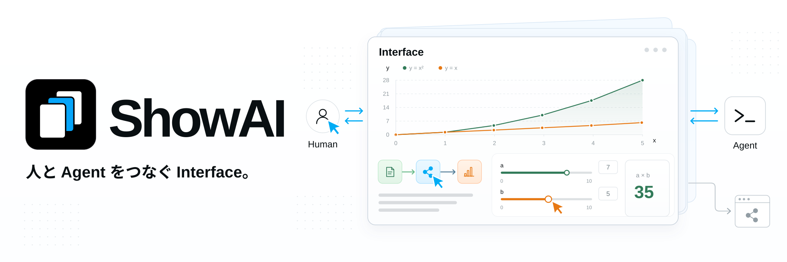
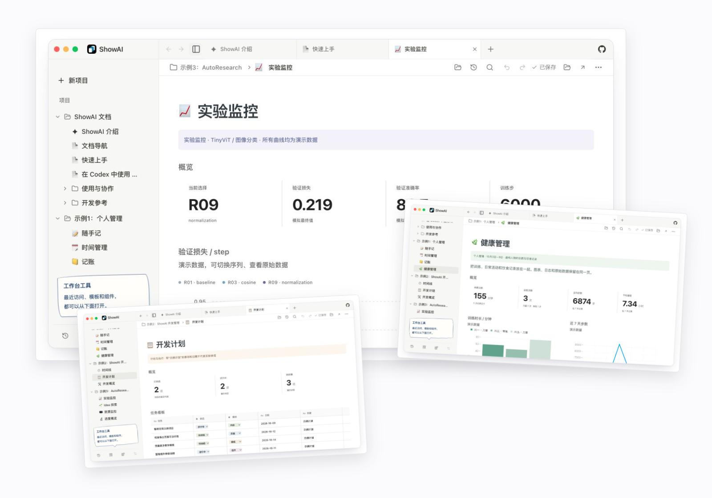
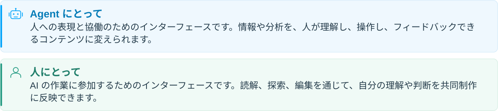
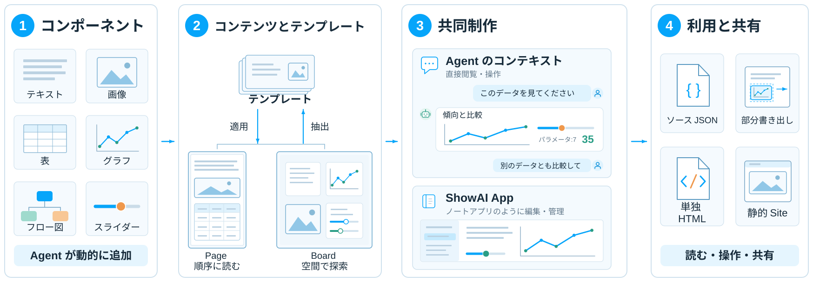

[](https://showai.renaissancemind.ai/)

**言語:** [English](../../README.md) | [简体中文](README.zh-CN.md) | [繁體中文](README.zh-TW.md) | 日本語 | [한국어](README.ko.md) | [Español](README.es.md) | [Türkçe](README.tr.md) | [Русский](README.ru.md)

ShowAI は、読める・操作できる・編集できるコンテンツを通じて、人と Agent が一緒に考えるためのツールです。Agent が情報や分析をページ、グラフ、インタラクティブなモデルにまとめ、人が読み、探索し、編集やフィードバックを加えます。同じコンテンツの中で理解を深め、判断し、制作を進められます。

この Interface は、人と Agent の協働・共同制作を支えます。共同で作ったコンテンツを共有可能な site にまとめ、ほかの人が読み、探索し、使い続けることもできます。

[](https://showai.renaissancemind.ai/)



### ✨ 理解から共同制作へ

- **情報に合った表現を選ぶ**：文章、画像、表、グラフ、フロー図、操作部品を同じコンテンツに配置します。研究結果を出典やデータに結び付け、複雑な関係を図で示し、パラメーターの変化をインタラクティブなモデルで確認できます。

  コンポーネントカタログには説明、パラメーターの構造、使用例があり、Agent が目的に合った部品を選べます。新しい表現が必要な場合は、React で再利用可能なコンポーネントを作成できます。

- **人がコンテンツに直接参加する**：Agent のコンテキスト内で内容を閲覧・操作するほか、ShowAI App でノートアプリのように編集・管理できます。Agent は人の編集を引き継げます。ページ構造、コンポーネントデータ、変更履歴を共有し、同じ成果物を継続的に改善できます。

  ページは比較、復元、構造化されたマージに対応します。同時編集で競合が起きた場合は、下書きと関連するバージョンを保存し、ユーザーが確認して解決できます。

- **成果を共有して活用する**：完成したコンテンツを単独の HTML、Agent の会話内に表示する断片、ナビゲーション付きの静的サイトとして書き出せます。

  単独の HTML にはページ、データ、使用するコンポーネントが含まれます。ShowAI をインストールせず、オフラインでも閲覧・操作できます。書き出した ShowAI HTML と JSON はワークベンチに読み込み、編集を続けられます。

## 🧩 設計



1. **コンポーネント：必要な形で情報を表現する。** 文章、画像、表、グラフ、フロー図、スライダーが、それぞれ異なる表現と操作を提供します。Agent は既存の部品を選ぶだけでなく、読者がパラメーターを調整して計算結果を確認する操作部品など、作業に必要な部品を作成・追加できます。

2. **コンテンツとテンプレート：内容をまとめ、構造を再利用する。** コンポーネントを組み合わせて、読める・操作できるコンテンツを作ります。[Page](../page-surface.md) は記事やレポートを順番に並べ、Board は空間的な配置で関係や案を整理します。よく使う構成をテンプレートに保存し、新しい資料を入れるか、完成したコンテンツからテンプレートを抽出して再利用できます。[コンポーネントとテンプレート](../catalog-lifecycle.md)を参照してください。

3. **共同制作：チャットとアプリで参加する。** ページ表示に対応した Agent の会話では、コンテンツがチャット内に直接表示されます。人がグラフや操作部品を確認した後、続く会話で Agent に分析や編集を依頼できます。

   ShowAI App は、プロジェクトやページの管理、直接編集、コンポーネントの再利用を行う、ノートアプリに似たワークベンチです。Agent のコンテキストで議論しながら、アプリでも内容を整理・改善できます。

4. **利用と共有：コンテンツを使い、届ける。** 単独の HTML は、ShowAI なしで閲覧・操作できます。静的 Site は複数ページをまとめ、URL での共有に適しています。部分書き出しで部品や領域を共有し、ソース JSON を読み込んで編集を続けることもできます。

## 💡 活用例

- **調査・分析**：問い、出典、証拠、比較結果を一つのページにまとめ、判断につなげます。
- **教育・解説**：フロー図、折りたたみコンテンツ、パラメーター実験を組み合わせ、段階的な理解を支えます。
- **データ探索**：グラフ、元データ、分析文をまとめ、確認しやすくします。
- **共同での計画作成**：人と Agent で案を改善し、変更を記録してバージョンを比較します。
- **知識の共有**：共同で作った内容をページや site にまとめ、ほかの人が読んで探索できるようにします。

## 🚀 はじめに

ソースからの実行には **Node.js 22.12+** と npm が必要です。

### ローカルのブラウザワークベンチ

```sh
git clone https://github.com/Renaissance-Mind/ShowAI.git
cd ShowAI
npm ci
npm run build:browser
npm run browser
```

起動後、ブラウザでローカルのワークベンチが開きます。使用中はターミナルを起動したままにし、停止するには `Ctrl+C` を押してください。

### デスクトップワークベンチ

リポジトリのディレクトリで依存関係をインストールした後、Electron アプリをビルドして起動します：

```sh
npm run build
npm run desktop
```

### 最初のコンテンツを作る

1. プロジェクトを作成し、Page または Board を作成します。
2. `/` を入力して部品を挿入するか、既存のテンプレートを選びます。
3. 内容を編集するか、接続した Agent と一緒に作ります。
4. 完成したら HTML または静的サイトを書き出します。

既定のコンテンツライブラリは `~/.showai` で、設定から変更できます。デスクトップアプリ、ブラウザワークベンチ、CLI が同じライブラリを参照する場合、同じプロジェクトを読み書きします。

ローカルブラウザ版は macOS、Linux、Windows に対応し、Node ランタイムを同梱した配布パッケージも作成できます。起動方法と要件は[ローカルブラウザ版の説明](../local-browser.md)を参照してください。

## 🤖 Agent を接続する

ShowAI は Codex と Claude Code のプラグインを提供します。プラグインをインストールし、ShowAI ランタイムに接続した後は、制作を直接依頼できます：

> 現在のプロジェクトにモデルの調査レポートを作り、出典、比較表、結論を同じページにまとめてください。

> この解説にパラメーターを調整できるインタラクティブなモデルを追加し、読者が変化の影響を確認できるようにしてください。

> このページから再利用可能なテンプレートを作り、それを使った例も作成してください。

### プラグインのインストール

**Codex**：リポジトリのディレクトリで実行します：

```sh
npm run plugin:install
```

**Claude Code**：リポジトリのディレクトリで実行します：

```sh
claude plugin marketplace add ./
claude plugin install showai@renaissance-mind
```

プラグインには四つの Skill が含まれます：

| Skill | 用途 |
| --- | --- |
| `use-showai` | 基本操作、ランタイム接続、コンテンツの検索・閲覧、履歴の確認 |
| `show-document` | ページの作成・編集・表示・書き出し、既存テンプレートの適用 |
| `create-component` | 再利用可能な React コンポーネントの作成・変更 |
| `create-template` | テンプレートの作成・編集、既存ページからの抽出 |

プラグインは制作手順と参照資料を提供し、実行プログラムは ShowAI アプリまたは単独のランタイムパッケージが提供します。デスクトップでは「设置 → 连接 Agent」から起動設定を取得できます。ソースからビルドした単独ランタイムでは、次を実行します：

```sh
npm run runtime:register
```

インストールと接続手順は[プラグインの説明](../../plugins/showai/README.md)を参照してください。

### CLI と MCP

CLI は各コマンドの実行後に終了し、ワークベンチを閉じた状態でも使えます。ビルド後、リポジトリのディレクトリで実行します：

```sh
# 既存のプロジェクトを表示
node dist-runtime/scripts/cli.mjs projects list --json

# 利用できるコンポーネントを検索
node dist-runtime/scripts/cli.mjs catalog list \
  --kind component --query 图表 --limit 5 --json

# ページ制作ガイドを表示
node dist-runtime/scripts/cli.mjs guide authoring --json
```

ほかの Agent クライアントは、任意の stdio MCP エントリーポイントから接続できます。コマンド、編集プロトコル、設定の詳細は [Agent 利用ガイド](../agent-usage.md)を参照してください。

## 📦 ページと Site の共有

| 書き出し形式 | 用途 |
| --- | --- |
| **単独の HTML** | 共有、オフラインでの閲覧、保存 |
| **inline 断片** | HTML 表示に対応した Agent の会話に表示 |
| **静的サイト** | 複数ページのナビゲーションと静的ホスティング |

単独の HTML は、グラフの切り替え、内容の折りたたみ、ローカルでのパラメーター計算などのオフライン操作に対応します。外部出典へのリンクにはネット接続が必要です。オフライン書き出しでは、画像を埋め込む必要があります。

以下の `PROJECT_ID` と `PAGE_ID` を実際の ID に置き換えて、ページを書き出します：

```sh
node dist-runtime/scripts/cli.mjs export \
  --project PROJECT_ID \
  --page PAGE_ID \
  --format html \
  --out ./report.html \
  --json
```

プロジェクト全体を静的サイトとして書き出します：

```sh
node dist-runtime/scripts/cli.mjs export \
  --project PROJECT_ID \
  --format site \
  --out ./site \
  --json
```

`--blocks ID,ID` で選択した部品や領域を書き出せます。HTML と inline の書き出しでは、再読み込みして編集を続けるための `.showai.json` ソースも保存されます。

静的サイトのディレクトリは、自分のサーバーやホスティングサービスに配置できます。書き出し形式とオプションは [Agent 利用ガイド](../agent-usage.md)を参照してください。

## 🔒 コンテンツと履歴

プロジェクトの内容はローカルに保存され、バックアップや移行ができます。新しい空のライブラリでは変更履歴が既定で有効になり、内容の変更と、取得可能な人や Agent の作成元情報が記録されます。

履歴画面でバージョンの比較、変更の確認、内容の復元ができます。復元は新しいバージョンを作ります。コンポーネント、テンプレート、ページの依存関係も管理され、過去の内容を追跡できます。

複数デバイスやほかの人と協働する場合は、自分で運用する ShowAI Server に接続し、プロジェクト単位で内容と履歴を同期できます。管理者、編集者、閲覧者のロールでアクセスを管理します。

[コンテンツライブラリと履歴](../versioned-library.md)、[プロジェクトサーバーと同期](../project-sync.md)を参照してください。

## 📚 ドキュメント

| ドキュメント | 内容 |
| --- | --- |
| [Page と Board](../page-surface.md) | ページ、ボード、操作 |
| [Agent 利用ガイド](../agent-usage.md) | CLI、MCP、制作、書き出し |
| [プラグインの説明](../../plugins/showai/README.md) | Skill の分担とインストール |
| [データグラフ](../g2-components.md) | グラフの種類、データインターフェース、設定 |
| [コンポーネントとテンプレート](../catalog-lifecycle.md) | カタログ、バージョン、依存関係、再利用 |
| [コンテンツライブラリと履歴](../versioned-library.md) | 保存、比較、マージ、復元 |
| [プロジェクトサーバーと同期](../project-sync.md) | サーバー運用、プロジェクト権限、同期 |
| [ページのデータ形式](../artifact-format.md) | ページ構造とデータの規約 |

## 🛠️ 開発と貢献

ShowAI は React、TypeScript、Electron、Vite を使用します。リッチテキスト編集は Tiptap、フロー図は React Flow、データ可視化は G2 を使用します。

ホットリロードに対応した完全なデスクトップワークベンチを起動します：

```sh
npm run dev:open
```

現在の開発サービスを確認します：

```sh
npm run dev:status
```

ブラウザ開発版には `npm run dev:browser` を使います。既定の開発ライブラリは `.showai-dev/library` で、起動引数から別のディレクトリを指定できます。

変更を提出する前に実行してください：

```sh
npm run check
npm test
npm run build
```

デスクトップの動作には `npm run test:desktop`、Page と Board の操作には `npm run test:containers` と `npm run test:containers:desktop` を実行できます。

[Issues](https://github.com/Renaissance-Mind/ShowAI/issues) で不具合や活用例を報告するか、Pull Request でコード、コンポーネント、テンプレート、ドキュメントを貢献できます。不具合の報告には、実行環境、再現手順、期待する結果と実際の結果を含めてください。

## ライセンス

ShowAI は [MIT ライセンス](../../LICENSE)で提供されます。
