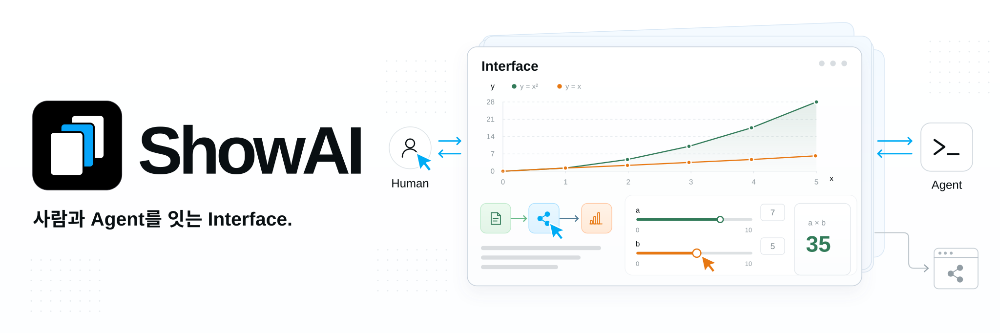
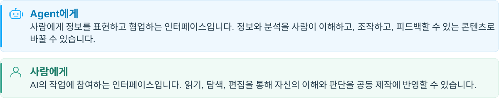

**언어:** [English](../../README.md) | [简体中文](README.zh-CN.md) | [繁體中文](README.zh-TW.md) | [日本語](README.ja.md) | 한국어 | [Español](README.es.md) | [Türkçe](README.tr.md) | [Русский](README.ru.md)

ShowAI는 읽고, 조작하고, 편집할 수 있는 콘텐츠를 통해 사람과 Agent가 함께 생각하도록 돕습니다. Agent는 정보와 분석을 페이지, 차트, 대화형 모델로 정리하고, 사람은 읽기, 탐색, 수정, 피드백으로 참여합니다. 같은 콘텐츠에서 이해를 쌓고 판단하며 작업을 발전시킬 수 있습니다.

이 Interface는 사람과 Agent의 협업과 공동 제작을 지원합니다. 함께 만든 콘텐츠를 공유 가능한 site로 만들어 다른 사람도 읽고, 탐색하고, 계속 활용할 수 있습니다.



### ✨ 이해에서 공동 제작으로

- **정보에 맞는 표현 사용하기**: 텍스트, 이미지, 표, 차트, 흐름도, 대화형 컨트롤을 같은 콘텐츠에 배치합니다. 연구 결과를 출처와 데이터에 연결하고, 복잡한 관계를 흐름도로 설명하며, 대화형 모델로 매개변수 변화의 영향을 확인할 수 있습니다.

  컴포넌트 카탈로그는 설명, 매개변수 구조, 예제를 제공해 Agent가 목적에 맞는 컴포넌트를 선택하도록 돕습니다. 새로운 표현이 필요하면 React로 재사용 가능한 컴포넌트를 만들 수 있습니다.

- **사람이 콘텐츠에 직접 참여하기**: Agent의 컨텍스트에서 콘텐츠를 보고 사용하거나, ShowAI App에서 노트 앱처럼 편집하고 관리할 수 있습니다. Agent는 사람이 수정한 내용을 이어서 처리합니다. 페이지 구조, 컴포넌트 데이터, 버전 이력을 공유하며 같은 결과물을 계속 개선할 수 있습니다.

  페이지는 비교, 복원, 구조화된 병합을 지원합니다. 동시 수정으로 충돌이 발생하면 초안과 관련 버전을 보존해 사용자가 확인하고 해결할 수 있습니다.

- **결과물 공유하기**: 완성한 콘텐츠를 독립 HTML, Agent 대화에 표시하는 조각, 탐색 기능을 갖춘 정적 사이트로 내보낼 수 있습니다.

  독립 HTML에는 페이지, 데이터, 사용한 컴포넌트가 포함됩니다. 독자는 ShowAI를 설치하지 않고도 오프라인에서 읽고 조작할 수 있습니다. 내보낸 ShowAI HTML과 JSON은 워크벤치로 가져와 편집을 이어갈 수 있습니다.

## 🧩 설계


1. **컴포넌트: 필요에 맞게 정보를 표현합니다.** 텍스트, 이미지, 표, 차트, 흐름도, 슬라이더는 다양한 표현과 상호작용을 제공합니다. Agent는 기존 컴포넌트를 선택하거나, 독자가 매개변수를 조정하고 계산 결과를 확인하는 컨트롤처럼 작업에 필요한 컴포넌트를 만들어 추가할 수 있습니다.

2. **콘텐츠와 템플릿: 내용을 구성하고 구조를 재사용합니다.** 컴포넌트를 조합해 읽고 조작할 수 있는 콘텐츠를 만듭니다. [Page](../page-surface.md)는 글과 보고서를 순서대로 구성하고, Board는 공간 배치로 관계와 제안을 정리합니다. 서로 중첩할 수도 있습니다. 자주 쓰는 구성과 조합을 템플릿으로 저장해 새 자료를 채우거나, 완성한 콘텐츠에서 템플릿을 추출해 재사용할 수 있습니다. [컴포넌트와 템플릿](../catalog-lifecycle.md)을 참고하세요.

3. **공동 제작: 대화와 앱에서 참여합니다.** 페이지 표시를 지원하는 Agent 대화에서는 콘텐츠가 채팅에 직접 나타납니다. 사람은 차트를 확인하고 컨트롤을 사용한 뒤, 후속 대화로 Agent에게 추가 분석과 편집을 요청할 수 있습니다.

   ShowAI App은 프로젝트와 페이지 관리, 직접 편집, 컴포넌트 재사용을 위한 노트 앱 형태의 워크벤치입니다. Agent 컨텍스트에서 논의하면서 앱에서도 콘텐츠를 계속 정리하고 개선할 수 있습니다.

4. **활용과 전달: 콘텐츠를 사용하고 공유합니다.** 독립 HTML은 ShowAI 없이도 읽기와 상호작용을 유지합니다. 정적 Site는 여러 페이지를 구성해 URL로 공유하기에 적합합니다. 부분 내보내기로 컴포넌트나 영역을 공유하고, 원본 JSON을 가져와 편집을 이어갈 수도 있습니다.

## 💡 활용 사례

- **조사와 분석**: 질문, 출처, 근거, 비교 결과를 한 페이지에 정리해 판단합니다.
- **교육과 설명**: 흐름도, 접을 수 있는 콘텐츠, 매개변수 실험을 결합해 단계적인 이해를 돕습니다.
- **데이터 탐색**: 차트, 원본 데이터, 분석 내용을 함께 두어 확인하고 검증하기 쉽게 합니다.
- **계획 공동 작성**: 사람과 Agent가 제안을 계속 수정하고, 변경 사항을 기록하며 버전을 비교합니다.
- **지식 공유**: 함께 만든 콘텐츠를 페이지나 site로 정리해 다른 사람이 읽고 탐색하도록 합니다.

## 🚀 시작하기

소스에서 실행하려면 **Node.js 22.12+**와 npm이 필요합니다.

### 로컬 브라우저 워크벤치

```sh
git clone https://github.com/Renaissance-Mind/ShowAI.git
cd ShowAI
npm ci
npm run build:browser
npm run browser
```

시작하면 브라우저에서 로컬 워크벤치가 열립니다. 사용하는 동안 터미널을 실행한 상태로 유지하고, 서비스를 중지하려면 `Ctrl+C`를 누르세요.

### 데스크톱 워크벤치

저장소 디렉터리에서 의존성을 설치한 뒤 Electron 앱을 빌드하고 실행합니다:

```sh
npm run build
npm run desktop
```

### 첫 콘텐츠 만들기

1. 프로젝트를 만든 다음 Page 또는 Board를 만듭니다.
2. `/`를 입력해 컴포넌트를 삽입하거나 기존 템플릿을 선택합니다.
3. 콘텐츠를 편집하거나 연결한 Agent와 함께 만듭니다.
4. 완성하면 HTML 또는 정적 사이트로 내보냅니다.

기본 콘텐츠 라이브러리는 `~/.showai`이며 설정에서 변경할 수 있습니다. 데스크톱 앱, 브라우저 워크벤치, CLI가 같은 라이브러리를 가리키면 같은 프로젝트를 읽고 씁니다.

로컬 브라우저 버전은 macOS, Linux, Windows를 지원하며 Node 런타임을 포함한 배포 패키지로 만들 수도 있습니다. 실행 방법과 플랫폼 요구 사항은 [로컬 브라우저 버전 안내](../local-browser.md)를 참고하세요.

## 🤖 Agent 연결하기

ShowAI는 Codex와 Claude Code 플러그인을 제공합니다. 플러그인을 설치하고 ShowAI 런타임에 연결하면 제작 요청을 직접 전달할 수 있습니다:

> 현재 프로젝트에 모델 조사 보고서를 만들고 출처, 비교표, 결론을 한 페이지에 정리해 주세요.

> 이 설명에 매개변수를 조정할 수 있는 대화형 모델을 추가해 독자가 변화의 영향을 관찰하도록 해 주세요.

> 이 페이지를 재사용 가능한 템플릿으로 만들고 사용 예제도 만들어 주세요.

### 플러그인 설치

**Codex**: 저장소 디렉터리에서 실행합니다:

```sh
npm run plugin:install
```

**Claude Code**: 저장소 디렉터리에서 실행합니다:

```sh
claude plugin marketplace add ./
claude plugin install showai@renaissance-mind
```

플러그인에는 네 가지 Skill이 포함됩니다:

| Skill | 용도 |
| --- | --- |
| `use-showai` | 기본 사용법, 런타임 연결, 콘텐츠 검색과 읽기, 이력 확인 |
| `show-document` | 페이지 생성, 편집, 표시, 내보내기와 기존 템플릿 적용 |
| `create-component` | 재사용 가능한 React 컴포넌트 생성 또는 수정 |
| `create-template` | 템플릿 생성과 편집, 기존 페이지에서 템플릿 추출 |

플러그인은 제작 절차와 참고 자료를 제공하며, 실행 프로그램은 ShowAI 앱 또는 독립 런타임 패키지가 제공합니다. 데스크톱 사용자는 「设置 → 连接 Agent」에서 시작 설정을 얻을 수 있습니다. 소스에서 빌드한 독립 런타임 패키지에서는 다음을 실행합니다:

```sh
npm run runtime:register
```

설치와 연결 절차는 [플러그인 안내](../../plugins/showai/README.md)를 참고하세요.

### CLI와 MCP

CLI는 명령 하나를 실행한 뒤 종료되며, 워크벤치가 닫힌 상태에서도 사용할 수 있습니다. 빌드한 뒤 저장소 디렉터리에서 실행합니다:

```sh
# 기존 프로젝트 확인
node dist-runtime/scripts/cli.mjs projects list --json

# 사용 가능한 컴포넌트 검색
node dist-runtime/scripts/cli.mjs catalog list \
  --kind component --query 图表 --limit 5 --json

# 페이지 제작 안내 확인
node dist-runtime/scripts/cli.mjs guide authoring --json
```

다른 Agent 클라이언트는 선택 사항인 stdio MCP 진입점을 통해 연결할 수 있습니다. 전체 명령, 편집 프로토콜, 설정은 [Agent 사용 안내](../agent-usage.md)를 참고하세요.

## 📦 페이지와 Site 공유

| 내보내기 형식 | 용도 |
| --- | --- |
| **독립 HTML** | 공유, 오프라인 읽기, 보관 |
| **inline 조각** | HTML 표시를 지원하는 Agent 대화에 표시 |
| **정적 사이트** | 여러 페이지 탐색과 정적 호스팅 |

독립 HTML은 차트 전환, 콘텐츠 접기, 로컬 매개변수 계산 등의 오프라인 상호작용을 지원합니다. 외부 출처 링크에는 인터넷 연결이 필요하며, 오프라인 내보내기에는 이미지가 포함되어 있어야 합니다.

아래 `PROJECT_ID`와 `PAGE_ID`를 실제 ID로 바꿔 페이지를 내보냅니다:

```sh
node dist-runtime/scripts/cli.mjs export \
  --project PROJECT_ID \
  --page PAGE_ID \
  --format html \
  --out ./report.html \
  --json
```

프로젝트 전체를 정적 사이트로 내보냅니다:

```sh
node dist-runtime/scripts/cli.mjs export \
  --project PROJECT_ID \
  --format site \
  --out ./site \
  --json
```

`--blocks ID,ID`로 선택한 컴포넌트나 영역을 내보낼 수 있습니다. HTML과 inline 내보내기는 다시 가져와 편집할 수 있도록 `.showai.json` 원본 파일도 저장합니다.

정적 사이트 디렉터리는 자체 서버나 호스팅 서비스에 배포할 수 있습니다. 내보내기 형식과 옵션은 [Agent 사용 안내](../agent-usage.md)를 참고하세요.

## 🔒 콘텐츠와 이력

프로젝트 콘텐츠는 로컬에 저장되며 백업과 이전을 지원합니다. 새 빈 라이브러리는 기본적으로 버전 이력을 활성화하며, 콘텐츠 변경과 확인할 수 있는 사람 또는 Agent의 작성 출처를 기록합니다.

이력 화면은 버전 비교, 변경 확인, 콘텐츠 복원을 지원합니다. 복원하면 새 버전이 만들어집니다. 컴포넌트, 템플릿, 페이지 의존성도 버전 관리에 포함되어 과거 콘텐츠를 추적할 수 있습니다.

여러 기기나 다른 사람과 협업하려면 직접 호스팅하는 ShowAI Server에 연결해 프로젝트별로 콘텐츠와 이력을 동기화할 수 있습니다. 관리자, 편집자, 뷰어 역할로 접근 권한을 관리합니다.

[콘텐츠 라이브러리와 이력](../versioned-library.md), [프로젝트 서버와 동기화](../project-sync.md)를 참고하세요.

## 📚 문서

| 문서 | 내용 |
| --- | --- |
| [Page와 Board](../page-surface.md) | 페이지, 보드, 중첩, 상호작용 |
| [Agent 사용 안내](../agent-usage.md) | CLI, MCP, 제작, 내보내기 |
| [플러그인 안내](../../plugins/showai/README.md) | Skill 역할과 설치 |
| [데이터 차트](../g2-components.md) | 차트 종류, 데이터 인터페이스, 설정 |
| [컴포넌트와 템플릿](../catalog-lifecycle.md) | 카탈로그, 버전, 의존성, 재사용 |
| [콘텐츠 라이브러리와 이력](../versioned-library.md) | 저장, 비교, 병합, 복원 |
| [프로젝트 서버와 동기화](../project-sync.md) | 서버 배포, 프로젝트 권한, 동기화 |
| [페이지 데이터 형식](../artifact-format.md) | 페이지 구조와 데이터 규약 |

## 🛠️ 개발과 기여

ShowAI는 React, TypeScript, Electron, Vite를 사용합니다. 리치 텍스트 편집은 Tiptap, 흐름도는 React Flow, 데이터 시각화는 G2를 기반으로 합니다.

핫 리로드를 지원하는 전체 데스크톱 워크벤치를 실행합니다:

```sh
npm run dev:open
```

현재 개발 서비스를 확인합니다:

```sh
npm run dev:status
```

브라우저 개발 버전은 `npm run dev:browser`를 사용합니다. 기본 개발 라이브러리는 `.showai-dev/library`이며 시작 인수로 다른 디렉터리를 지정할 수 있습니다.

변경 사항을 제출하기 전에 실행합니다:

```sh
npm run check
npm test
npm run build
```

데스크톱 동작은 `npm run test:desktop`으로, Page와 Board 상호작용은 `npm run test:containers`와 `npm run test:containers:desktop`으로 확인할 수 있습니다.

[Issues](https://github.com/Renaissance-Mind/ShowAI/issues)에서 문제를 보고하거나 활용 사례를 제안할 수 있습니다. Pull Request로 코드, 컴포넌트, 템플릿, 문서를 기여할 수도 있습니다. 문제를 보고할 때는 실행 환경, 재현 단계, 예상 결과와 실제 결과를 포함해 주세요.

## 라이선스

ShowAI는 [MIT 라이선스](../../LICENSE)를 사용합니다.
