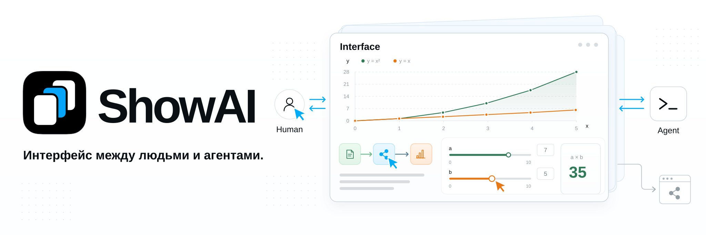

**Язык:** [English](../../README.md) | [简体中文](README.zh-CN.md) | [繁體中文](README.zh-TW.md) | [日本語](README.ja.md) | [한국어](README.ko.md) | [Español](README.es.md) | [Türkçe](README.tr.md) | Русский

ShowAI помогает людям и агентам думать вместе через контент, который можно читать, исследовать и редактировать. Агенты организуют информацию и анализ в страницы, графики и интерактивные модели. Люди участвуют через чтение, исследование, правки и обратную связь. Обе стороны работают с одним контентом, развивают понимание, принимают решения и продвигают совместную работу.

Этот интерфейс поддерживает сотрудничество и совместное создание контента. Результат можно превратить в сайт, которым другие люди смогут пользоваться: читать, исследовать и продолжать работу.

> [!NOTE]
> **🤖 Для агентов:** Интерфейс для общения и сотрудничества с людьми, который превращает информацию и анализ в понятный, доступный для взаимодействия и обратной связи контент.

**🧑 Для людей:** Интерфейс для участия в работе ИИ, позволяющий вносить собственное понимание и суждения через чтение, исследование и редактирование.

### ✨ От понимания к совместному созданию

- **Выбирайте подходящую форму представления**: Объединяйте текст, изображения, таблицы, графики, блок-схемы и интерактивные элементы в одном контенте. Связывайте результаты исследований с источниками и данными, объясняйте сложные отношения схемами и изучайте изменения параметров с помощью интерактивных моделей.

  Каталог компонентов содержит описания, структуры параметров и примеры, чтобы агенты могли выбирать компоненты под задачу. Если нужна новая форма представления, можно создать переиспользуемый компонент на React.

- **Позволяйте людям участвовать напрямую**: Просматривайте и используйте контент в контексте агента или редактируйте и организуйте его в ShowAI App, как в приложении для заметок. Агент может продолжать работу после правок человека. Обе стороны используют общую структуру страниц, данные компонентов и историю версий, улучшая один и тот же результат.

  Страницы поддерживают сравнение, восстановление и структурированное слияние. При конфликте одновременных изменений система сохраняет черновики и соответствующие версии, чтобы пользователь мог проверить их и разрешить конфликт.

- **Делитесь результатами**: Экспортируйте готовый контент в автономный HTML, фрагмент для показа в диалоге с агентом или статический сайт с навигацией.

  Автономный HTML включает страницу, данные и используемые компоненты. Читатели могут работать без сети и без установки ShowAI. Экспортированные ShowAI HTML и JSON можно импортировать в рабочую среду и продолжить редактирование.

## 🧩 Устройство


1. **Компоненты: представляйте информацию под задачу.** Текст, изображения, таблицы, графики, блок-схемы и ползунки дают разные способы представления и взаимодействия. Агент может выбрать готовые компоненты или создать и добавить новые, например элементы для изменения параметров и просмотра результатов расчётов.

2. **Контент и шаблоны: организуйте материал и используйте структуры повторно.** Компоненты объединяются в контент, который можно читать и использовать. [Page](../page-surface.md) последовательно организует статьи и отчёты; Board располагает отношения и предложения в пространстве. Их можно вкладывать друг в друга. Сохраняйте часто используемые структуры и комбинации компонентов как шаблоны: заполняйте шаблон новым материалом или извлекайте его из готового контента для дальнейшего использования. См. [Компоненты и шаблоны](../catalog-lifecycle.md).

3. **Совместное создание: участвуйте в чате и приложении.** В диалогах с агентами, поддерживающих показ страниц, контент отображается прямо в чате. Люди могут изучать графики и использовать элементы управления, а затем просить агента продолжить анализ и редактирование в следующих сообщениях.

   ShowAI App предоставляет рабочую среду, похожую на приложение для заметок: для управления проектами и страницами, прямого редактирования и повторного использования компонентов. Обсуждение может идти в контексте агента, а организация и улучшение контента — в приложении.

4. **Использование и передача: делайте контент доступным для работы и обмена.** Автономный HTML сохраняет чтение и взаимодействие без ShowAI. Статический Site объединяет несколько страниц для доступа по URL. Частичный экспорт позволяет передать компонент или область, а исходный JSON — импортировать результат и продолжить редактирование.

## 💡 Сценарии использования

- **Исследование и анализ**: Организуйте вопросы, источники, доказательства и сравнения на одной странице для принятия решения.
- **Обучение и объяснение**: Объединяйте схемы, сворачиваемый контент и эксперименты с параметрами для постепенного понимания.
- **Исследование данных**: Держите графики, исходные данные и анализ вместе для просмотра и проверки.
- **Совместное планирование**: Улучшайте предложения вместе с агентом, записывайте изменения и сравнивайте версии.
- **Обмен знаниями**: Превращайте совместную работу в страницы или сайты, которые другие люди смогут читать и исследовать.

## 🚀 Начало работы

Для запуска из исходного кода нужны **Node.js 22.12+** и npm.

### Локальная рабочая среда в браузере

```sh
git clone https://github.com/Renaissance-Mind/ShowAI.git
cd ShowAI
npm ci
npm run build:browser
npm run browser
```

После запуска браузер откроет локальную рабочую среду. Во время работы оставляйте терминал запущенным; для остановки службы нажмите `Ctrl+C`.

### Настольная рабочая среда

После установки зависимостей в каталоге репозитория соберите и запустите приложение Electron:

```sh
npm run build
npm run desktop
```

### Создайте первый контент

1. Создайте проект, затем Page или Board.
2. Введите `/`, чтобы вставить компоненты, или выберите готовый шаблон.
3. Отредактируйте контент самостоятельно или вместе с подключённым агентом.
4. По завершении экспортируйте HTML или статический сайт.

Библиотека контента по умолчанию расположена в `~/.showai`; её можно изменить в настройках. Настольное приложение, браузерная среда и CLI читают и записывают одни и те же проекты, если используют одну библиотеку.

Локальная браузерная версия поддерживает macOS, Linux и Windows. Её также можно упаковать со встроенной средой выполнения Node. Запуск и требования к платформам описаны в [Руководстве по локальной браузерной версии](../local-browser.md).

## 🤖 Подключение агента

ShowAI предоставляет плагины для Codex и Claude Code. После установки плагина и подключения к среде выполнения ShowAI можно напрямую просить создать контент:

> Создай в текущем проекте исследовательский отчёт о моделях: источники, сравнительную таблицу и выводы размести на одной странице.

> Добавь к этому объяснению интерактивную модель с изменяемыми параметрами, чтобы читатели могли наблюдать влияние изменений.

> Преврати эту страницу в переиспользуемый шаблон и создай пример его применения.

### Установка плагина

**Codex**: Выполните в каталоге репозитория:

```sh
npm run plugin:install
```

**Claude Code**: Выполните в каталоге репозитория:

```sh
claude plugin marketplace add ./
claude plugin install showai@renaissance-mind
```

Плагин включает четыре Skill:

| Skill | Назначение |
| --- | --- |
| `use-showai` | Основы работы, подключение среды выполнения, поиск и чтение контента, просмотр истории |
| `show-document` | Создание, редактирование, показ и экспорт страниц; применение готовых шаблонов |
| `create-component` | Создание или изменение переиспользуемых компонентов React |
| `create-template` | Создание и редактирование шаблонов, извлечение из готовых страниц |

Плагин предоставляет процессы создания контента и справочные материалы. Исполняемая среда поставляется приложением ShowAI или отдельным пакетом. В настольном приложении настройки запуска доступны в разделе Настройки → Подключить Agent (「设置 → 连接 Agent」). Для отдельного пакета, собранного из исходного кода, выполните:

```sh
npm run runtime:register
```

Шаги установки и подключения приведены в [Документации плагина](../../plugins/showai/README.md).

### CLI и MCP

CLI завершает работу после каждой команды и может использоваться при закрытой рабочей среде. После сборки выполните команды в каталоге репозитория:

```sh
# Список существующих проектов
node dist-runtime/scripts/cli.mjs projects list --json

# Поиск доступных компонентов
node dist-runtime/scripts/cli.mjs catalog list \
  --kind component --query 图表 --limit 5 --json

# Руководство по созданию страниц
node dist-runtime/scripts/cli.mjs guide authoring --json
```

Другие клиенты агентов могут подключаться через необязательную точку входа stdio MCP. Полный список команд, протокол редактирования и настройки приведены в [Руководстве для агентов](../agent-usage.md).

## 📦 Обмен страницами и сайтами

| Формат экспорта | Использование |
| --- | --- |
| **Автономный HTML** | Обмен, чтение без сети и архивирование |
| **Фрагмент inline** | Показ в диалогах с агентами, поддерживающих HTML |
| **Статический сайт** | Навигация по нескольким страницам и статический хостинг |

Автономный HTML поддерживает офлайн-взаимодействие: переключение графиков, сворачивание контента и локальные расчёты параметров. Ссылки на внешние источники требуют подключения к сети. Для офлайн-экспорта изображения должны быть встроены.

Для экспорта страницы замените `PROJECT_ID` и `PAGE_ID` реальными идентификаторами:

```sh
node dist-runtime/scripts/cli.mjs export \
  --project PROJECT_ID \
  --page PAGE_ID \
  --format html \
  --out ./report.html \
  --json
```

Экспортируйте весь проект как статический сайт:

```sh
node dist-runtime/scripts/cli.mjs export \
  --project PROJECT_ID \
  --format site \
  --out ./site \
  --json
```

Используйте `--blocks ID,ID` для экспорта выбранных компонентов или областей. Экспорт HTML и inline также сохраняет исходный файл `.showai.json` для повторного импорта и дальнейшего редактирования.

Каталог статического сайта можно разместить на собственном сервере или хостинге. Форматы и параметры экспорта описаны в [Руководстве для агентов](../agent-usage.md).

## 🔒 Контент и история

Контент проектов хранится локально, поддерживает резервное копирование и перенос. В новых пустых библиотеках история версий включена по умолчанию: она записывает изменения и доступную информацию о происхождении контента от человека или агента.

Интерфейс истории позволяет сравнивать версии, просматривать изменения и восстанавливать контент. Восстановление создаёт новую версию. Компоненты, шаблоны и зависимости страниц также версионируются, чтобы можно было отследить прежний контент.

Для совместной работы на разных устройствах или с другими людьми подключите самостоятельно размещённый ShowAI Server. Он синхронизирует контент и историю по проектам; доступ управляется ролями администратора, редактора и читателя.

См. [Библиотека контента и история](../versioned-library.md) и [Сервер проектов и синхронизация](../project-sync.md).

## 📚 Документация

| Документ | Содержание |
| --- | --- |
| [Page и Board](../page-surface.md) | Страницы, доски, вложенность и взаимодействие |
| [Руководство для агентов](../agent-usage.md) | CLI, MCP, создание контента и экспорт |
| [Документация плагина](../../plugins/showai/README.md) | Назначение Skill и установка |
| [Графики данных](../g2-components.md) | Типы графиков, интерфейсы данных и настройки |
| [Компоненты и шаблоны](../catalog-lifecycle.md) | Каталог, версии, зависимости и повторное использование |
| [Библиотека контента и история](../versioned-library.md) | Хранение, сравнение, слияние и восстановление |
| [Сервер проектов и синхронизация](../project-sync.md) | Развёртывание сервера, права проектов и синхронизация |
| [Формат данных страниц](../artifact-format.md) | Структура страниц и соглашения о данных |

## 🛠️ Разработка и участие

ShowAI использует React, TypeScript, Electron и Vite. Редактирование форматированного текста основано на Tiptap, блок-схемы — на React Flow, визуализация данных — на G2.

Запустите полную настольную рабочую среду с горячей перезагрузкой:

```sh
npm run dev:open
```

Проверьте текущую службу разработки:

```sh
npm run dev:status
```

Для браузерной разработки используйте `npm run dev:browser`. Библиотека разработки по умолчанию находится в `.showai-dev/library`; аргументы запуска позволяют выбрать другой каталог.

Перед отправкой изменений выполните:

```sh
npm run check
npm test
npm run build
```

Для поведения настольного приложения можно запустить `npm run test:desktop`. Для взаимодействий Page и Board — `npm run test:containers` и `npm run test:containers:desktop`.

Сообщайте о проблемах и предлагайте сценарии через [Issues](https://github.com/Renaissance-Mind/ShowAI/issues) или вносите код, компоненты, шаблоны и документацию через Pull Request. При сообщении о проблеме укажите среду выполнения, шаги воспроизведения, ожидаемый и фактический результат.

## Лицензия

ShowAI распространяется под [лицензией MIT](../../LICENSE).
