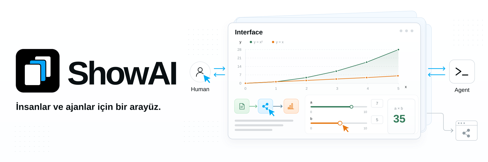
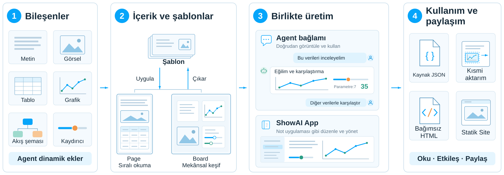

**Dil:** [English](../../README.md) | [简体中文](README.zh-CN.md) | [繁體中文](README.zh-TW.md) | [日本語](README.ja.md) | [한국어](README.ko.md) | [Español](README.es.md) | Türkçe | [Русский](README.ru.md)

ShowAI, insanların ve ajanların okunabilir, etkileşimli ve düzenlenebilir içerik üzerinden birlikte düşünmesini sağlar. Ajanlar bilgi ve analizleri sayfalara, grafiklere ve etkileşimli modellere dönüştürür. İnsanlar okuyarak, keşfederek, değişiklik yaparak ve geri bildirim vererek katılır. İki taraf aynı içerik üzerinde anlayış geliştirir, karar verir ve üretimi ilerletir.

Bu arayüz, insanlarla ajanların iş birliğini ve birlikte üretimini destekler. Ortaya çıkan içerik, başkalarının okuyabileceği, keşfedebileceği ve kullanmaya devam edebileceği paylaşılabilir bir siteye de dönüştürülebilir.


### ✨ Anlamaktan birlikte üretmeye

- **Bilgiyi uygun biçimde ifade edin**: Metinleri, görselleri, tabloları, grafikleri, akış şemalarını ve etkileşimli kontrolleri aynı içerikte birleştirin. Araştırma bulgularını kaynak ve verilere bağlayın, karmaşık ilişkileri şemalarla açıklayın ve parametre değişimlerini etkileşimli modellerde gözlemleyin.

  Bileşen kataloğu, ajanların göreve uygun bileşenleri seçebilmesi için açıklamalar, parametre yapıları ve örnekler sunar. Yeni bir ifade biçimi gerektiğinde React ile yeniden kullanılabilir bileşenler oluşturabilirsiniz.

- **İnsanların doğrudan katılmasını sağlayın**: İçeriği ajanın bağlamında görüntüleyip kullanın veya ShowAI App içinde bir not uygulamasındaki gibi düzenleyip yönetin. Ajan, insanların yaptığı değişikliklerden devam edebilir. Sayfa yapısı, bileşen verileri ve sürüm geçmişi paylaşılır; aynı çalışma sürekli geliştirilebilir.

  Sayfalar karşılaştırma, geri yükleme ve yapılandırılmış birleştirmeyi destekler. Eşzamanlı değişiklikler çakıştığında sistem, kullanıcıların inceleyip çözmesi için taslakları ve ilgili sürümleri korur.

- **Sonuçları paylaşın**: Tamamlanan içeriği bağımsız HTML, ajan sohbetinde gösterilen bir parça veya gezinme özelliği olan statik bir site olarak dışa aktarın.

  Bağımsız HTML; sayfayı, verileri ve kullanılan bileşenleri içerir. Okuyucular ShowAI kurmadan çevrimdışı okuyabilir ve etkileşime girebilir. Dışa aktarılan ShowAI HTML ve JSON dosyaları, düzenlemeye devam etmek için çalışma alanına yeniden aktarılabilir.

## 🧩 Tasarım



1. **Bileşenler: bilgiyi ihtiyaca göre ifade edin.** Metinler, görseller, tablolar, grafikler, akış şemaları ve kaydırıcılar farklı ifade ve etkileşim biçimleri sunar. Ajanlar mevcut bileşenleri seçebilir veya okuyucuların parametreleri değiştirip hesaplama sonuçlarını inceleyebildiği kontroller gibi göreve uygun yeni bileşenler oluşturup ekleyebilir.

2. **İçerik ve şablonlar: içeriği düzenleyin, yapıları yeniden kullanın.** Bileşenler okunabilir ve kullanılabilir içerik oluşturmak için birleştirilir. [Page](../page-surface.md), yazı ve raporları sırayla düzenler; Board, ilişkileri ve önerileri mekânsal olarak yerleştirir. Sık kullanılan yapıları ve bileşen birleşimlerini şablon olarak kaydedin: bir şablonu yeni malzemeyle doldurun veya bitmiş içerikten gelecekte kullanmak üzere şablon çıkarın. [Bileşenler ve şablonlar](../catalog-lifecycle.md) belgesine bakın.

3. **Ortak üretim: sohbette ve uygulamada katılın.** Sayfa gösterimini destekleyen ajan sohbetlerinde içerik doğrudan sohbet içinde görünür. İnsanlar grafikleri inceleyip kontrolleri kullanabilir, ardından yeni mesajlarla ajandan analiz ve düzenlemeye devam etmesini isteyebilir.

   ShowAI App; projeleri ve sayfaları yönetmek, içeriği doğrudan düzenlemek ve bileşenleri yeniden kullanmak için not uygulamasına benzer bir çalışma alanı sunar. Tartışma ajanın bağlamında sürerken içerik uygulamada düzenlenip geliştirilebilir.

4. **Kullanım ve paylaşım: içeriği kullanılabilir ve paylaşılabilir hâle getirin.** Bağımsız HTML, ShowAI gerektirmeden okumayı ve etkileşimi korur. Statik Site, birden fazla sayfayı URL ile paylaşılabilecek şekilde düzenler. Kısmi dışa aktarma ile bir bileşen veya bölge paylaşılabilir; kaynak JSON ise içeriğin yeniden aktarılıp düzenlenmesini sağlar.

## 💡 Kullanım alanları

- **Araştırma ve analiz**: Soruları, kaynakları, kanıtları ve karşılaştırmaları tek sayfada düzenleyerek bir değerlendirmeye ulaşın.
- **Eğitim ve açıklama**: Şemaları, daraltılabilir içeriği ve parametre deneylerini birleştirerek aşamalı anlamayı destekleyin.
- **Veri keşfi**: Grafikleri, ham verileri ve analiz metnini inceleme ve doğrulama için bir arada tutun.
- **Ortak planlama**: İnsanlarla ajanlar arasında önerileri geliştirin, değişiklikleri kaydedin ve sürümleri karşılaştırın.
- **Bilgi paylaşımı**: Ortak çalışmayı başkalarının okuyup keşfedebileceği sayfa veya sitelere dönüştürün.

## 🚀 Başlangıç

Kaynak koddan çalıştırmak için **Node.js 22.12+** ve npm gerekir.

### Yerel tarayıcı çalışma alanı

```sh
git clone https://github.com/Renaissance-Mind/ShowAI.git
cd ShowAI
npm ci
npm run build:browser
npm run browser
```

Başlatıldıktan sonra tarayıcı yerel çalışma alanını açar. Kullanım sırasında terminali açık tutun; hizmeti durdurmak için `Ctrl+C` tuşlarına basın.

### Masaüstü çalışma alanı

Depo dizininde bağımlılıkları kurduktan sonra Electron uygulamasını derleyip başlatın:

```sh
npm run build
npm run desktop
```

### İlk içeriğinizi oluşturun

1. Bir proje, ardından bir Page veya Board oluşturun.
2. Bileşen eklemek için `/` yazın veya mevcut bir şablon seçin.
3. İçeriği düzenleyin veya bağlı bir ajanla birlikte oluşturun.
4. Tamamlandığında HTML veya statik site olarak dışa aktarın.

Varsayılan içerik kütüphanesi `~/.showai` dizinidir ve ayarlardan değiştirilebilir. Masaüstü uygulaması, tarayıcı çalışma alanı ve CLI aynı kütüphaneye yönlendirildiğinde aynı projeleri okur ve yazar.

Yerel tarayıcı sürümü macOS, Linux ve Windows'u destekler. Node çalışma zamanı içeren bir dağıtım paketi de hazırlanabilir. Başlatıcı ve platform gereksinimleri için [Yerel tarayıcı sürümü](../local-browser.md) belgesine bakın.

## 🤖 Bir ajan bağlayın

ShowAI, Codex ve Claude Code eklentileri sunar. Eklentiyi kurup ShowAI çalışma zamanına bağladıktan sonra içerik üretimini doğrudan isteyebilirsiniz:

> Geçerli projede modeller hakkında bir araştırma raporu oluştur; kaynakları, karşılaştırma tablosunu ve sonuçları aynı sayfada düzenle.

> Bu açıklamaya parametreleri ayarlanabilen etkileşimli bir model ekle; okuyucular değişikliklerin etkisini gözlemleyebilsin.

> Bu sayfayı yeniden kullanılabilir bir şablona dönüştür ve şablonu kullanan bir örnek oluştur.

### Eklenti kurulumu

**Codex**: Depo dizininde çalıştırın:

```sh
npm run plugin:install
```

**Claude Code**: Depo dizininde çalıştırın:

```sh
claude plugin marketplace add ./
claude plugin install showai@renaissance-mind
```

Eklenti dört Skill içerir:

| Skill | Amaç |
| --- | --- |
| `use-showai` | Temel kullanım, çalışma zamanı bağlantısı, içerik bulma ve okuma, geçmişi görüntüleme |
| `show-document` | Sayfa oluşturma, düzenleme, gösterme ve dışa aktarma; mevcut şablonları uygulama |
| `create-component` | Yeniden kullanılabilir React bileşenleri oluşturma veya uyarlama |
| `create-template` | Şablon oluşturma, düzenleme veya mevcut sayfalardan çıkarma |

Eklenti, içerik üretme akışları ve başvuru belgeleri sağlar. Çalıştırılabilir programı ShowAI uygulaması veya bağımsız çalışma zamanı paketi sağlar. Masaüstü kullanıcıları başlangıç yapılandırmasını Ayarlar → Agent Bağla (「设置 → 连接 Agent」) bölümünden alabilir. Kaynak koddan derlenmiş bağımsız paket için çalıştırın:

```sh
npm run runtime:register
```

Kurulum ve bağlantı adımları için [Eklenti belgesi](../../plugins/showai/README.md) bölümüne bakın.

### CLI ve MCP

CLI her komutun ardından kapanır ve çalışma alanı kapalıyken kullanılabilir. Derledikten sonra depo dizininde şu komutları çalıştırın:

```sh
# Mevcut projeleri listele
node dist-runtime/scripts/cli.mjs projects list --json

# Kullanılabilir bileşenleri ara
node dist-runtime/scripts/cli.mjs catalog list \
  --kind component --query 图表 --limit 5 --json

# Sayfa oluşturma kılavuzunu görüntüle
node dist-runtime/scripts/cli.mjs guide authoring --json
```

Diğer ajan istemcileri isteğe bağlı stdio MCP giriş noktasından bağlanabilir. Tüm komutlar, düzenleme protokolü ve yapılandırma için [Ajan kılavuzu](../agent-usage.md) belgesine bakın.

## 📦 Sayfa ve site paylaşımı

| Dışa aktarma biçimi | Kullanım |
| --- | --- |
| **Bağımsız HTML** | Paylaşım, çevrimdışı okuma ve arşivleme |
| **inline parça** | HTML gösterimini destekleyen ajan sohbetlerinde gösterim |
| **Statik site** | Birden fazla sayfada gezinme ve statik barındırma |

Bağımsız HTML; grafik değiştirme, içerik daraltma ve yerel parametre hesaplama gibi çevrimdışı etkileşimleri destekler. Harici kaynak bağlantıları ağ bağlantısı gerektirir. Çevrimdışı dışa aktarma için görseller gömülü olmalıdır.

Sayfayı dışa aktarmak için aşağıdaki `PROJECT_ID` ve `PAGE_ID` değerlerini gerçek kimliklerle değiştirin:

```sh
node dist-runtime/scripts/cli.mjs export \
  --project PROJECT_ID \
  --page PAGE_ID \
  --format html \
  --out ./report.html \
  --json
```

Projenin tamamını statik site olarak dışa aktarın:

```sh
node dist-runtime/scripts/cli.mjs export \
  --project PROJECT_ID \
  --format site \
  --out ./site \
  --json
```

Seçilen bileşenleri veya bölgeleri dışa aktarmak için `--blocks ID,ID` kullanın. HTML ve inline dışa aktarımları, içeriği yeniden aktarabilmek ve düzenleyebilmek için `.showai.json` kaynak dosyasını da kaydeder.

Statik site dizini kendi sunucunuza veya bir barındırma hizmetine dağıtılabilir. Biçimler ve seçenekler için [Ajan kılavuzu](../agent-usage.md) belgesine bakın.

## 🔒 İçerik ve geçmiş

Proje içeriği yerel olarak saklanır; yedeklenebilir ve taşınabilir. Yeni boş kütüphanelerde sürüm geçmişi varsayılan olarak etkinleştirilir. İçerik değişiklikleri ve mevcut insan veya ajan kaynak bilgileri kaydedilir.

Geçmiş arayüzü sürüm karşılaştırma, değişiklik inceleme ve içerik geri yüklemeyi destekler. Geri yükleme yeni bir sürüm oluşturur. Bileşenler, şablonlar ve sayfa bağımlılıkları da geçmiş içeriğin izlenebilmesi için sürümlenir.

Cihazlar arasında veya başka kişilerle iş birliği yapmak için kendi barındırdığınız ShowAI Server'a bağlanın. İçerik ve geçmiş proje bazında eşitlenir; yönetici, düzenleyici ve görüntüleyici rolleriyle erişim denetlenir.

[İçerik kütüphanesi ve geçmiş](../versioned-library.md) ile [Proje sunucusu ve eşitleme](../project-sync.md) belgelerine bakın.

## 📚 Belgeler

| Belge | İçerik |
| --- | --- |
| [Page ve Board](../page-surface.md) | Sayfalar, panolar ve etkileşim |
| [Ajan kılavuzu](../agent-usage.md) | CLI, MCP, içerik üretme ve dışa aktarma |
| [Eklenti belgesi](../../plugins/showai/README.md) | Skill görevleri ve kurulum |
| [Veri grafikleri](../g2-components.md) | Grafik türleri, veri arayüzleri ve ayarlar |
| [Bileşenler ve şablonlar](../catalog-lifecycle.md) | Katalog, sürümler, bağımlılıklar ve yeniden kullanım |
| [İçerik kütüphanesi ve geçmiş](../versioned-library.md) | Saklama, karşılaştırma, birleştirme ve geri yükleme |
| [Proje sunucusu ve eşitleme](../project-sync.md) | Sunucu dağıtımı, proje izinleri ve eşitleme |
| [Sayfa veri biçimi](../artifact-format.md) | Sayfa yapısı ve veri kuralları |

## 🛠️ Geliştirme ve katkı

ShowAI; React, TypeScript, Electron ve Vite kullanır. Zengin metin düzenleme Tiptap, akış şemaları React Flow, veri görselleştirme ise G2 ile sağlanır.

Anında yenilemeyi destekleyen tam masaüstü çalışma alanını başlatın:

```sh
npm run dev:open
```

Geçerli geliştirme hizmetini kontrol edin:

```sh
npm run dev:status
```

Tarayıcı geliştirmesi için `npm run dev:browser` kullanın. Varsayılan geliştirme kütüphanesi `.showai-dev/library` dizinidir; başlangıç argümanlarıyla başka bir dizin seçebilirsiniz.

Değişiklik göndermeden önce çalıştırın:

```sh
npm run check
npm test
npm run build
```

Masaüstü davranışı için `npm run test:desktop` çalıştırabilirsiniz. Page ve Board etkileşimleri için `npm run test:containers` ve `npm run test:containers:desktop` kullanın.

Sorun bildirmek veya kullanım alanı önermek için [Issues](https://github.com/Renaissance-Mind/ShowAI/issues) kullanın. Kod, bileşen, şablon ve belgelere Pull Request ile katkıda bulunabilirsiniz. Sorun bildirirken çalışma ortamını, yeniden üretme adımlarını, beklenen ve gerçekleşen sonuçları ekleyin.

## Lisans

ShowAI, [MIT Lisansı](../../LICENSE) ile sunulur.
