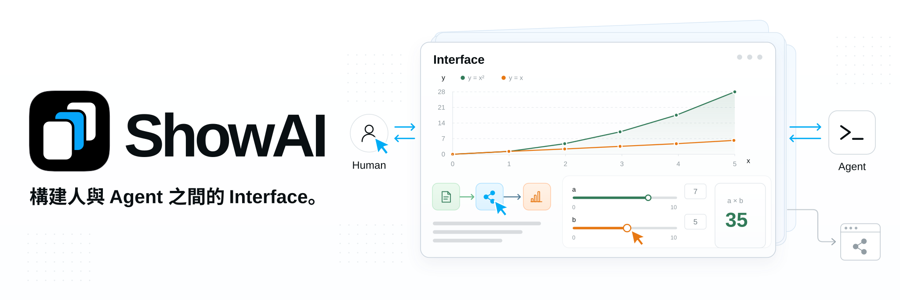
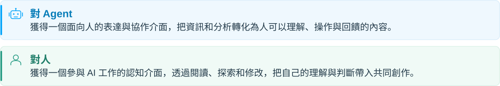
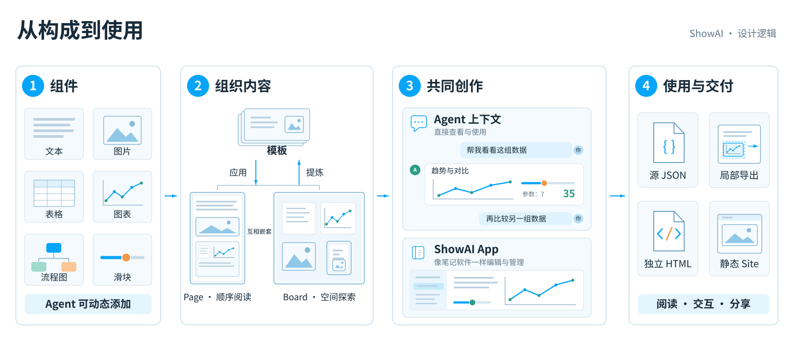

**語言:** [English](../../README.md) | [简体中文](README.zh-CN.md) | 繁體中文 | [日本語](README.ja.md) | [한국어](README.ko.md) | [Español](README.es.md) | [Türkçe](README.tr.md) | [Русский](README.ru.md)

ShowAI 讓人與 Agent 透過可閱讀、可互動、可編輯的內容共同思考。Agent 將資訊與分析組織成頁面、圖表和互動模型，人透過閱讀、探索、修改和回饋參與其中，雙方在同一份內容上持續形成理解、作出判斷並推進創作。

這個 Interface 承載人機協作與共創，也讓共同形成的內容成為可分享的 site，供更多人閱讀、探索和繼續使用。



### ✨ 從理解到共創

- **讓資訊有合適的表達**：把文字、圖片、表格、圖表、流程圖和互動控制元件放在同一份內容中。研究發現可以對應到來源與資料，複雜關係可以展開為流程圖，參數變化可以透過互動模型觀察。

  元件庫提供說明、參數結構和示例，幫助 Agent 根據表達需要選擇元件。需要新的表達方式時，可以用 React 建立可重用元件。

- **讓人直接參與內容**：人在 Agent 上下文中直接檢視和使用內容，也可以在 ShowAI App 中像使用筆記軟體一樣編輯和管理內容。Agent 可以繼續處理人的修改，雙方共享頁面結構、元件資料與版本歷史，持續完善同一份成果。

  頁面支援比較、還原與結構化合併。併發修改發生衝突時，系統保留草稿和相關版本，供使用者檢查與處理。

- **讓成果繼續流動**：完成的內容可以匯出為獨立 HTML、Agent 對話中的展示片段，或帶導航的靜態網站。

  獨立 HTML 包含頁面、資料和所用元件，讀者無需安裝 ShowAI，也可以離線閱讀與操作。匯出的 ShowAI HTML 和 JSON 可以重新匯入工作台，繼續編輯。

## 🧩 設計邏輯



1. **元件：按需要表達資訊。** 文字、圖片、表格、圖表、流程圖和滑桿提供不同的表達與互動方式。Agent 可以選擇已有元件，也可以根據任務建立並加入新元件，例如讓讀者調整參數、觀察計算結果的控制元件。

2. **內容（模板）：組織內容，重用結構。** 元件組合成可閱讀、可操作的內容。[Page](../page-surface.md) 按順序組織文章與報告，Board 用空間佈局組織關係與方案；兩者可以互相巢狀。常用的內容結構和元件組合可以儲存為模板：應用模板填入新材料，或從完成的內容中提煉模板，供後續創作重用。詳見[元件與模板說明](../catalog-lifecycle.md)。

3. **共同創作：在聊天與 App 中參與。** 在支援頁面展示的 Agent 會話中，內容直接呈現在聊天裡。人可以檢視圖表、操作控制元件，再透過後續對話讓 Agent 繼續分析和修改。

   ShowAI App 提供類似筆記軟體的工作台，用於管理專案與頁面、直接編輯內容和重用元件。討論可以在 Agent 上下文中展開，內容也可以在 App 中持續整理和完善。

4. **使用與交付：讓內容被使用和分享。** 獨立 HTML 保留頁面的閱讀與互動，讀者無需安裝 ShowAI；靜態 Site 組織多頁內容，適合透過網址分享。區域性匯出可以只分享某個元件或區域，源 JSON 則用於匯入並繼續編輯，讓成果能夠持續使用。

## 💡 使用場景

- **調研與分析**：組織問題、來源、證據和比較結果，在同一頁中形成判斷。
- **教學與講解**：結合流程圖、摺疊內容和參數實驗，幫助讀者逐步理解。
- **資料探索**：把圖表、原始資料和分析文字放在一起，方便檢視與核對。
- **方案共創**：在人與 Agent 之間持續修改方案，記錄變化並比較版本。
- **知識分享**：將共同形成的內容整理為頁面或 site，供他人閱讀和探索。

## 🚀 開始使用

從原始碼執行需要 **Node.js 22.12+** 和 npm。

### 本地瀏覽器工作台

```sh
git clone https://github.com/Renaissance-Mind/ShowAI.git
cd ShowAI
npm ci
npm run build:browser
npm run browser
```

啟動後，瀏覽器會開啟本機工作台。使用期間保持終端執行，按 `Ctrl+C` 停止服務。

### 桌面工作台

在倉庫目錄中安裝依賴後，構建並啟動 Electron 應用：

```sh
npm run build
npm run desktop
```

### 建立第一份內容

1. 新建專案，再建立一個 Page 或 Board。
2. 輸入 `/`，插入需要的元件；也可以選擇已有模板。
3. 編輯內容，或讓連線的 Agent 一起創作。
4. 完成後匯出 HTML 或靜態網站。

預設內容庫為 `~/.showai`，可在設定中更改。桌面應用、瀏覽器工作台與 CLI 指向同一內容庫時，共同讀寫其中的專案。

本地瀏覽器版支援 macOS、Linux 和 Windows，也可以打包為自帶 Node 執行時的發行包。啟動器與平臺要求見[本地瀏覽器版說明](../local-browser.md)。

## 🤖 連線 Agent

ShowAI 提供 Codex 與 Claude Code 外掛。安裝外掛並連線 ShowAI 執行時後，可以直接提出創作需求：

> 在當前專案中做一份模型調研報告，把來源、對比表和結論組織在同一頁。

> 修改這份講解，加入可以調整參數的互動模型，讓讀者觀察參數變化的影響。

> 把這頁整理成可重用模板，並生成一個應用示例。

### 安裝外掛

**Codex**：在倉庫目錄中執行：

```sh
npm run plugin:install
```

**Claude Code**：在倉庫目錄中執行：

```sh
claude plugin marketplace add ./
claude plugin install showai@renaissance-mind
```

外掛包含四個 Skill：

| Skill | 用途 |
| --- | --- |
| `use-showai` | 基礎用法、連線執行時、查詢和閱讀內容、檢視歷史 |
| `show-document` | 建立、修改、展示和匯出頁面，應用已有模板 |
| `create-component` | 建立或改造可重用的 React 元件 |
| `create-template` | 建立、修改模板，或從已有頁面提煉模板 |

外掛提供創作流程與參考說明，執行程式由 ShowAI 應用或獨立執行包提供。桌面使用者可在「设置 → 连接 Agent」中取得啟動配置；從原始碼構建的獨立執行包可執行：

```sh
npm run runtime:register
```

安裝與接入步驟見[外掛說明](../../plugins/showai/README.md)。

### CLI 與 MCP

CLI 每次執行一個命令後退出，可以在工作台關閉時使用。完成構建後，在倉庫目錄中執行：

```sh
# 查看現有專案
node dist-runtime/scripts/cli.mjs projects list --json

# 查詢可用元件
node dist-runtime/scripts/cli.mjs catalog list \
  --kind component --query 图表 --limit 5 --json

# 查看頁面創作指南
node dist-runtime/scripts/cli.mjs guide authoring --json
```

其他 Agent 客戶端也可以透過可選的 stdio MCP 入口接入。完整命令、編輯協議與配置見 [Agent 使用說明](../agent-usage.md)。

## 📦 分享頁面與 Site

| 匯出格式 | 適用場景 |
| --- | --- |
| **獨立 HTML** | 分享、離線閱讀和歸檔 |
| **inline 片段** | 在支援 HTML 展示的 Agent 對話中呈現 |
| **靜態網站** | 多頁面導航與靜態託管 |

獨立 HTML 支援圖表切換、摺疊內容和本地參數計算等離線互動；外部來源連結需要聯網。離線匯出要求圖片已內嵌。

將下方的 `PROJECT_ID` 和 `PAGE_ID` 替換為實際 ID，即可匯出頁面：

```sh
node dist-runtime/scripts/cli.mjs export \
  --project PROJECT_ID \
  --page PAGE_ID \
  --format html \
  --out ./report.html \
  --json
```

匯出整個專案的靜態網站：

```sh
node dist-runtime/scripts/cli.mjs export \
  --project PROJECT_ID \
  --format site \
  --out ./site \
  --json
```

使用 `--blocks ID,ID` 可以匯出選定的元件或區域。HTML 與 inline 匯出同時儲存 `.showai.json` 原始檔，便於重新匯入和繼續編輯。

靜態網站目錄可部署到自己的伺服器或託管服務。匯出格式與選項見 [Agent 使用說明](../agent-usage.md)。

## 🔒 內容與歷史

專案內容儲存在本機，支援備份與遷移。新建的空內容庫預設啟用版本歷史，記錄內容變化及可獲得的人工或 Agent 來源資訊。

歷史介面支援比較版本、檢視變更和還原內容；還原會生成新的版本。元件、模板與頁面依賴也納入版本管理，便於追溯過去的內容。

需要跨裝置或與他人協作時，可以連線自部署的 ShowAI Server，按專案同步內容與歷史，並透過管理員、編輯者和檢視者角色管理訪問許可權。

詳見[內容庫與歷史](../versioned-library.md)及[專案伺服器與同步](../project-sync.md)。

## 📚 文件

| 文件 | 內容 |
| --- | --- |
| [Page 與 Board](../page-surface.md) | 頁面、白板、巢狀與互動 |
| [Agent 使用說明](../agent-usage.md) | CLI、MCP、創作與匯出 |
| [外掛說明](../../plugins/showai/README.md) | Skill 分工與安裝 |
| [資料圖表](../g2-components.md) | 圖表型別、資料介面與設定 |
| [元件與模板](../catalog-lifecycle.md) | 目錄、版本、依賴與重用 |
| [內容庫與歷史](../versioned-library.md) | 儲存、比較、合併與還原 |
| [專案伺服器與同步](../project-sync.md) | 服務部署、專案許可權與同步 |
| [頁面資料格式](../artifact-format.md) | 頁面結構與資料約定 |

## 🛠️ 開發與貢獻

ShowAI 使用 React、TypeScript、Electron 與 Vite。富文字編輯基於 Tiptap，流程圖基於 React Flow，資料視覺化使用 G2。

啟動支援熱更新的完整桌面工作台：

```sh
npm run dev:open
```

檢視當前開發服務：

```sh
npm run dev:status
```

瀏覽器開發版使用 `npm run dev:browser`。預設開發內容庫位於 `.showai-dev/library`，可以透過啟動參數指定其他目錄。

提交改動前執行：

```sh
npm run check
npm test
npm run build
```

涉及桌面行為時，可執行 `npm run test:desktop`；涉及 Page 與 Board 互動時，可執行 `npm run test:containers` 和 `npm run test:containers:desktop`。

歡迎透過 [Issues](https://github.com/Renaissance-Mind/ShowAI/issues) 回饋問題、提出使用場景，或透過 Pull Request 貢獻程式碼、元件、模板與文件。問題回饋請附上執行環境、復現步驟，以及預期與實際結果。

## 許可證

ShowAI 使用 [MIT 許可證](../../LICENSE)。
